# Overview

## Purpose and Scope

This document provides an introduction to the n8n-k8s repository, which contains a production-ready Kubernetes deployment stack for n8n workflow automation platform on k3s clusters. The repository implements a distributed, scalable architecture with auto-scaling capabilities, secure external access, and comprehensive configuration management.

For detailed information about individual components, see [Core Components](#3). For deployment instructions, see [Deployment Guide](#6). For architecture details, see [System Architecture](#2).

## What This Repository Provides

The n8n-k8s repository is a complete Kubernetes deployment solution that transforms n8n from a single-instance application into a distributed, horizontally-scalable workflow automation platform. n8n is an open-source workflow automation tool that allows users to connect different services and automate tasks through a visual interface.

This stack provides:

- **Distributed Processing**: Separates n8n main application from worker processes for improved scalability
- **Queue-Based Architecture**: Uses Redis for job queuing and asynchronous workflow execution  
- **Auto-Scaling**: Horizontal Pod Autoscaler (HPA) configurations for dynamic scaling
- **Secure Access**: Cloudflare tunnel integration for secure external connectivity
- **Data Persistence**: PostgreSQL StatefulSet for reliable workflow and execution data storage
- **Production-Ready**: Comprehensive configuration management with secrets and environment separation

## High-Level Architecture

The following diagram shows the main system components and their relationships, mapped to the actual Kubernetes resources and services defined in the manifests:

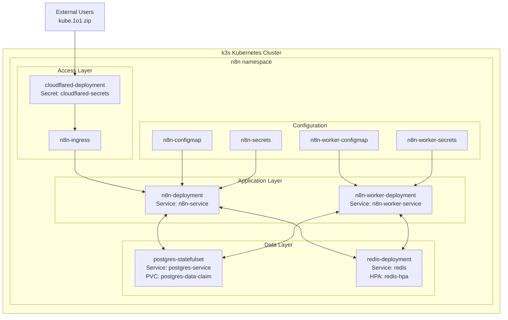


## Repository Organization

The repository follows a flat Kubernetes manifest structure optimized for recursive kubectl deployment:

| Component Type | Purpose | Key Files |
|----------------|---------|-----------|
| **Application Manifests** | Core n8n application and worker deployments | `n8n-deployment.yaml`, `n8n-worker-deployment.yaml` |
| **Data Services** | Persistent storage and caching services | `postgres-statefulset.yaml`, `redis-deployment.yaml` |
| **Configuration** | Environment configuration and secrets | `n8n-configmap.yaml`, `n8n-secrets.yaml`, `n8n-worker-*` variants |
| **Networking** | Service discovery and external access | `*-service.yaml`, `n8n-ingress.yaml` |
| **Scaling** | Auto-scaling configurations | `n8n-hpa.yaml`, `redis-hpa.yaml`, `n8n-worker-hpa.yaml` |
| **External Access** | Secure tunnel configuration | `cloudflared-deployment.yaml`, `cloudflared-secrets.yaml` |

## Component Overview

The stack implements a distributed n8n architecture with the following core components:

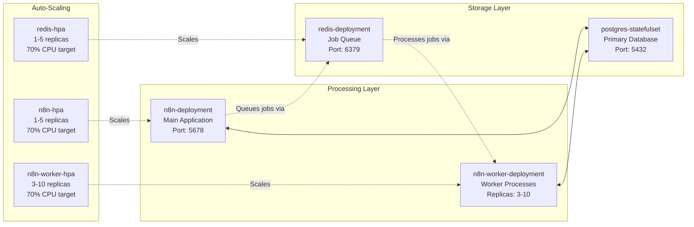


| Component | Purpose | Scaling Strategy |
|-----------|---------|------------------|
| **n8n Main App** | Web UI, API endpoints, workflow management | 1-5 replicas via HPA |
| **n8n Workers** | Distributed workflow execution | 3-10 replicas via HPA |
| **PostgreSQL** | Persistent storage for workflows and execution history | Single StatefulSet with persistent volume |
| **Redis** | Job queue and session caching | 1-5 replicas via HPA |
| **Cloudflared** | Secure tunnel for external access | 2 static replicas |

## Deployment Model

The repository uses a declarative Kubernetes deployment model designed for k3s clusters. The deployment process is simplified through recursive manifest application:

```bash
kubectl apply -f ./ -n n8n --recursive
```

This command processes all YAML manifests in the repository, creating the complete n8n stack with proper dependency ordering handled by Kubernetes. The stack is designed to be self-contained within the `n8n` namespace, making it easy to manage and isolate from other cluster workloads.

Key deployment characteristics:
- **Namespace Isolation**: All resources deployed to `n8n` namespace
- **Recursive Application**: Single command deploys entire stack
- **Dependency Management**: Kubernetes handles service startup ordering
- **External Access**: Immediate availability via Cloudflare tunnel at `kube.1o1.zip`

# System Architecture

<details>
<summary>Relevant source files</summary>

The following files were used as context for generating this wiki page:

- [README.md](README.md)
- [db/postgres-statefulset.yaml](db/postgres-statefulset.yaml)
- [n8n-configmap.yaml](n8n-configmap.yaml)
- [n8n-worker/n8n-worker-configmap.yaml](n8n-worker/n8n-worker-configmap.yaml)
- [redis/redis-deployment.yml](redis/redis-deployment.yml)

</details>


## Purpose and Scope

This document provides a comprehensive technical overview of the distributed n8n system architecture deployed on Kubernetes. It details how the main n8n application, worker nodes, database, cache layer, and external access components interact to provide a scalable workflow automation platform.

For specific component implementation details, see [Core Components](#3). For deployment procedures, see [Deployment Guide](#6). For scaling and operational aspects, see [Scaling and Operations](#5).

## Architectural Overview

The n8n-k8s system implements a distributed, queue-based architecture that separates the main application interface from workflow execution workers. This design enables horizontal scaling of workflow processing while maintaining a single point of access for users.

### System Components and Resource Mapping

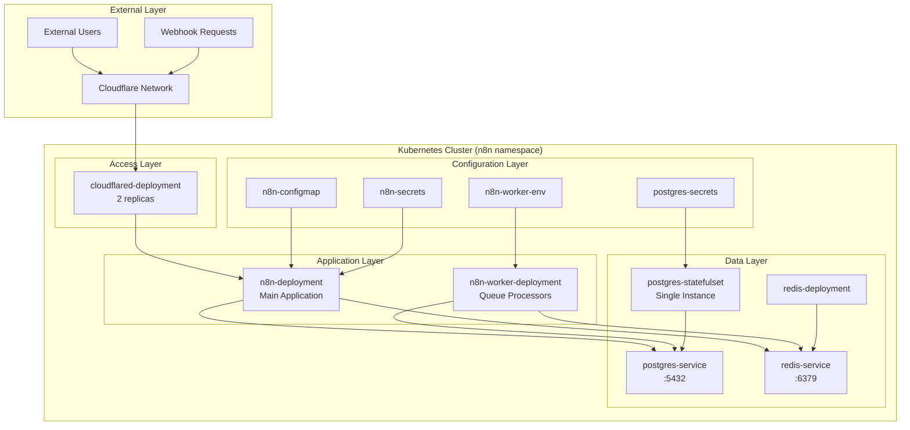


## Component Interaction and Data Flow

The system uses a queue-based architecture where the main n8n application handles user interactions and delegates workflow execution to dedicated worker processes through Redis.

### Service Communication Pattern

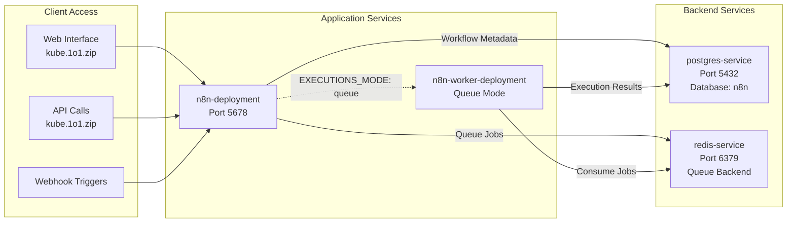

## Configuration Architecture

The system separates configuration concerns across multiple ConfigMaps and Secrets, enabling independent management of application settings and sensitive data.

### Configuration Data Flow

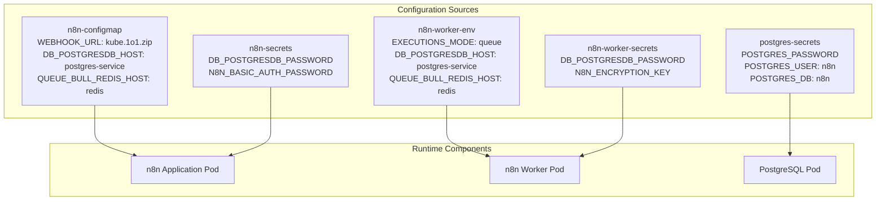


## Database and Queue Architecture

The persistence layer uses PostgreSQL for workflow definitions and execution history, while Redis handles ephemeral job queuing and inter-component communication.

### Data Storage Pattern

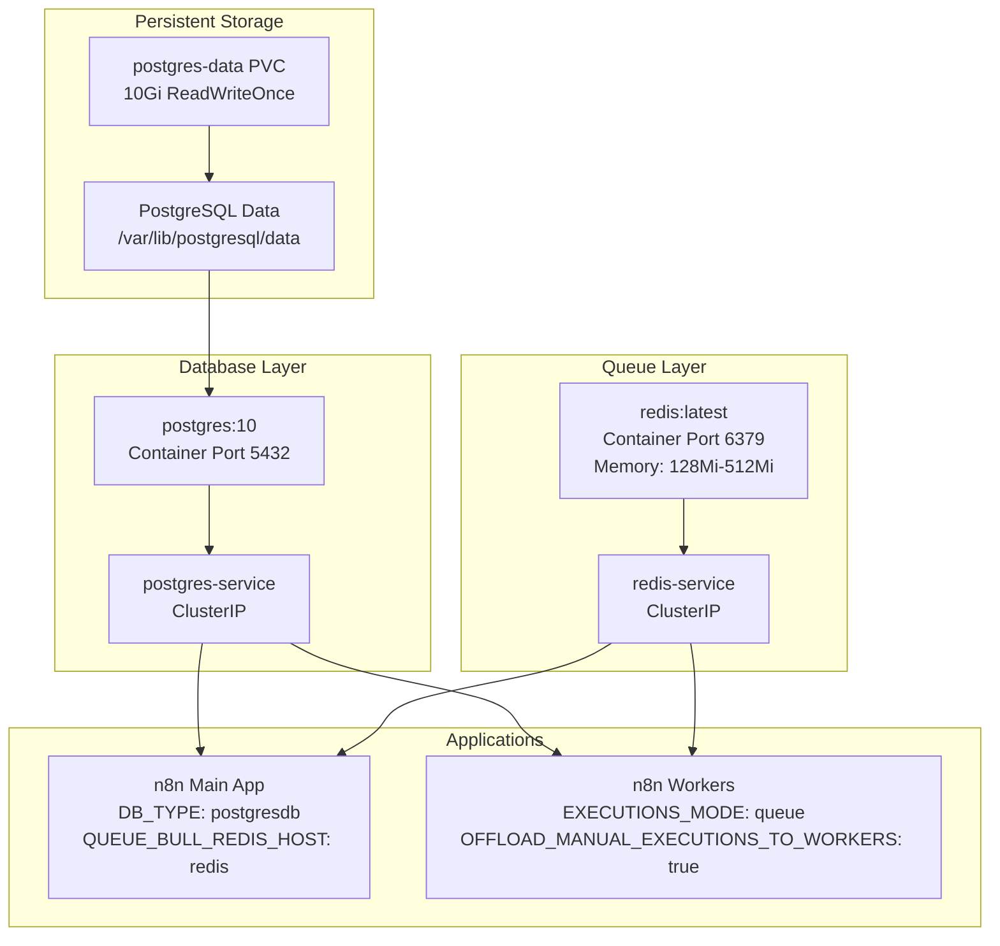


## Deployment Resource Structure

The system uses different Kubernetes resource types optimized for each component's requirements: StatefulSet for the database, Deployments for stateless components.

### Kubernetes Resource Topology

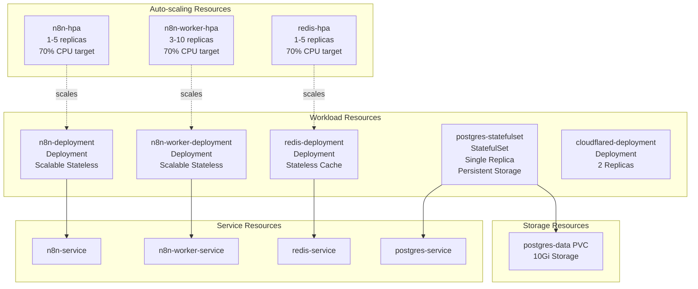


## External Access and Security Model

External access is managed through Cloudflare tunnels, providing secure connectivity without exposing services directly to the internet. The system implements basic authentication and uses configurable webhook URLs.

| Component | Access Method | Configuration Source |
|-----------|--------------|---------------------|
| Web Interface | `https://kube.1o1.zip/` | [n8n-configmap.yaml:13-14]() |
| Webhook Endpoints | `https://kube.1o1.zip/` | [n8n-configmap.yaml:13-14]() |
| Database | Internal ClusterIP | [n8n-configmap.yaml:19-20]() |
| Redis Queue | Internal ClusterIP | [n8n-configmap.yaml:26-27]() |
| Basic Auth | Username: `n8n` | [n8n-configmap.yaml:22-23]() |

The architecture ensures that only the Cloudflare tunnel has external connectivity, while all internal services communicate through Kubernetes ClusterIP services within the `n8n` namespace.

# Core Components

<details>
<summary>Relevant source files</summary>

The following files were used as context for generating this wiki page:

- [n8n-deployment.yaml](n8n-deployment.yaml)
- [n8n-worker/n8n-worker-deployment.yml](n8n-worker/n8n-worker-deployment.yml)

</details>


This document provides an overview of the main application components that comprise the n8n Kubernetes deployment. It covers the five core components that work together to provide a distributed, scalable workflow automation platform.

For detailed configuration and secrets management, see [Configuration Management](#4). For scaling and operational aspects, see [Scaling and Operations](#5).

## Component Overview

The n8n-k8s deployment consists of five core components that work together to provide a distributed workflow automation platform:

| Component | Purpose | Kubernetes Resources | Scaling |
|-----------|---------|---------------------|---------|
| n8n Application | Main web interface and API | `n8n-deployment` | HPA 1-5 replicas |
| n8n Workers | Distributed workflow execution | `n8n-worker` | HPA 3-10 replicas |
| PostgreSQL | Persistent data storage | `postgres-statefulset` | Single instance |
| Redis | Job queue and caching | `redis-deployment` | HPA 1-5 replicas |
| Cloudflared | External access tunnel | `cloudflared-deployment` | 2 replicas |

## Core Component Architecture

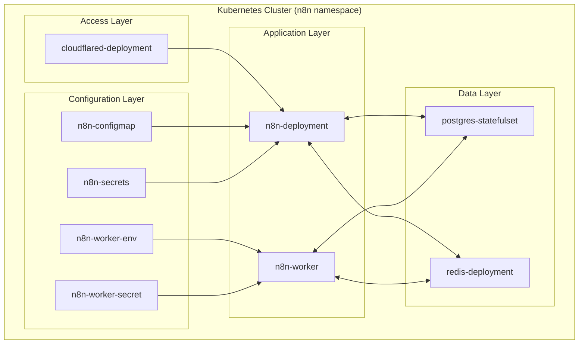


## Deployment Structure and Image Configuration

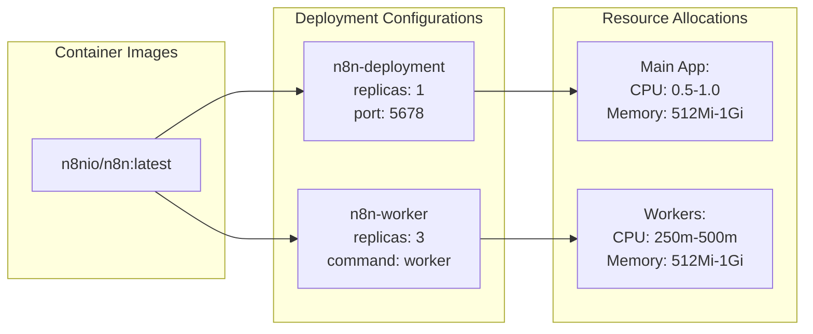


## n8n Application Component

The main n8n application serves as the web interface and API endpoint. It runs the `n8nio/n8n:latest` image with default command and exposes port `5678` for HTTP traffic. The deployment is configured with health checks using the `/healthz` endpoint and references configuration through `n8n-configmap` and `n8n-secrets`.

For detailed information about the main application deployment, configuration, and networking, see [n8n Application](#3.1).


## n8n Workers Component

The worker component handles distributed workflow execution by running the same `n8nio/n8n:latest` image with the `worker` command. Workers start with 3 replicas and can scale based on demand. They connect to the same database and Redis instances as the main application to process queued jobs.

For complete details on worker deployment and scaling configuration, see [n8n Workers](#3.2).


## Database Layer Component

PostgreSQL provides persistent storage for workflow definitions, execution history, and user data. The database is deployed as a StatefulSet to ensure data persistence and ordered scaling.

For database configuration, storage, and connection details, see [Database Layer](#3.3).

## Cache and Queue Layer Component

Redis serves dual purposes as both a job queue for workflow execution coordination and a cache for temporary data. It enables the distributed architecture by allowing the main application to queue jobs that workers can process asynchronously.

For Redis deployment, scaling, and queue configuration, see [Cache and Queue Layer](#3.4).

## External Access Component

Cloudflared provides secure external access to the n8n application through Cloudflare's tunnel service, eliminating the need to expose services directly to the internet.

For tunnel configuration and external access setup, see [External Access](#3.5).

## Component Communication

The components communicate through Kubernetes services and use environment variables for configuration. Both the main application and workers reference database credentials through secrets (`N8N_ENCRYPTION_KEY`, `DB_POSTGRESDB_PASSWORD`) and operational configuration through ConfigMaps.

# n8n Application

<details>
<summary>Relevant source files</summary>

The following files were used as context for generating this wiki page:

- [n8n-configmap.yaml](n8n-configmap.yaml)
- [n8n-deployment.yaml](n8n-deployment.yaml)
- [n8n-secrets.yaml](n8n-secrets.yaml)
- [n8n-service.yaml](n8n-service.yaml)

</details>


This document covers the main n8n application deployment, which serves as the primary user interface and workflow management component of the distributed n8n system. This component handles user interactions, workflow management, and coordinates with worker processes for distributed execution.

For information about the worker components that execute workflows, see [n8n Workers](#3.2). For database persistence, see [Database Layer](#3.3). For job queuing mechanisms, see [Cache and Queue Layer](#3.4).

## Component Overview

The n8n application consists of four primary Kubernetes resources that work together to provide the main application service:

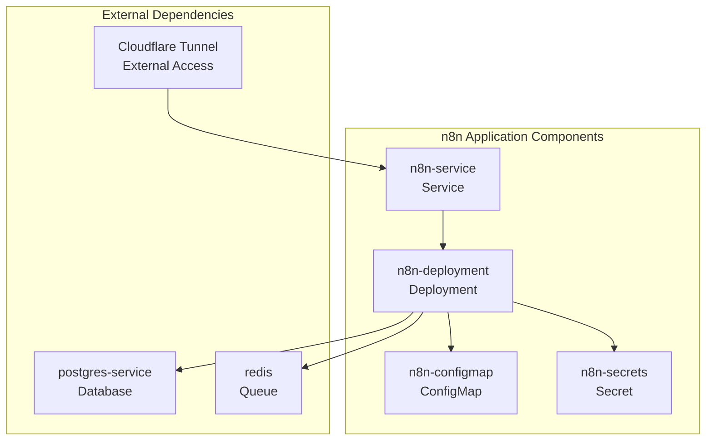


## Deployment Configuration

The main application deployment is defined in `n8n-deployment` and uses the official n8n Docker image with specific resource constraints and health monitoring:

| Configuration | Value | Purpose |
|---------------|-------|---------|
| Image | `n8nio/n8n:latest` | Official n8n container image |
| Replicas | 1 | Initial replica count (scalable via HPA) |
| Container Port | 5678 | Internal application port |
| CPU Requests | 0.5 cores | Minimum CPU allocation |
| CPU Limits | 1.0 cores | Maximum CPU allocation |
| Memory Requests | 512Mi | Minimum memory allocation |
| Memory Limits | 1024Mi | Maximum memory allocation |

The deployment includes health monitoring through liveness and readiness probes that check the `/healthz` endpoint on port 5678 [n8n-deployment.yaml:30-37]().

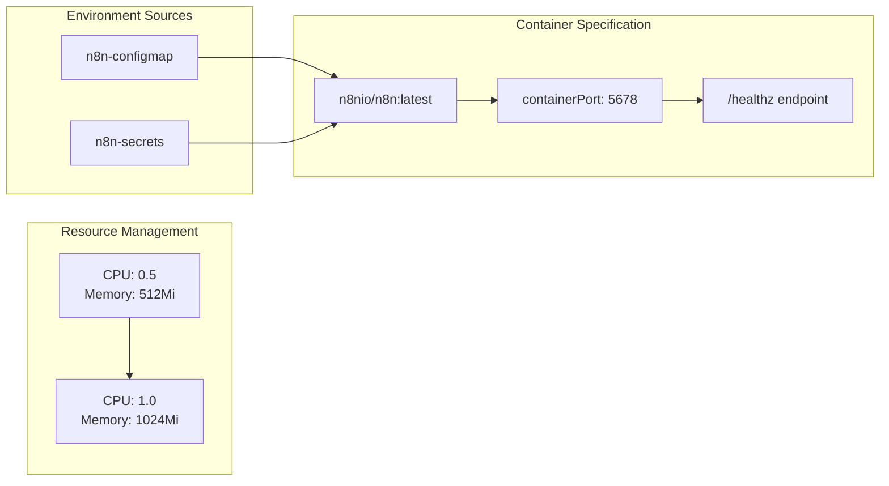


## Application Configuration

The application configuration is managed through the `n8n-configmap` resource, which defines environment variables for production operation:

### Core Environment Settings
- `NODE_ENV`: Set to "production" for optimized runtime behavior [n8n-configmap.yaml:11]()
- `GENERIC_TIMEZONE`: Configured for "Europe/Warsaw" timezone [n8n-configmap.yaml:12]()

### Database Configuration
The application connects to PostgreSQL using these environment variables:
- `DB_TYPE`: "postgresdb" [n8n-configmap.yaml:16]()
- `DB_POSTGRESDB_HOST`: "postgres-service" [n8n-configmap.yaml:19]()
- `DB_POSTGRESDB_PORT`: "5432" [n8n-configmap.yaml:20]()
- `DB_POSTGRESDB_USER`: "n8n" [n8n-configmap.yaml:17]()
- `DB_POSTGRESDB_DATABASE`: "n8n" [n8n-configmap.yaml:18]()

### Queue and Worker Configuration
The application operates in distributed mode with Redis-based job queuing:
- `EXECUTIONS_MODE`: "queue" enables distributed execution [n8n-configmap.yaml:25]()
- `QUEUE_BULL_REDIS_HOST`: "redis" [n8n-configmap.yaml:26]()
- `QUEUE_BULL_REDIS_PORT`: "6379" [n8n-configmap.yaml:27]()
- `N8N_RUNNERS_ENABLED`: "true" enables worker integration [n8n-configmap.yaml:24]()
- `OFFLOAD_MANUAL_EXECUTIONS_TO_WORKERS`: "true" [n8n-configmap.yaml:28]()

### External Access Configuration
Webhook URLs are configured to work with the Cloudflare tunnel:
- `WEBHOOK_TUNNEL_URL`: "https://kube.1o1.zip/" [n8n-configmap.yaml:13]()
- `WEBHOOK_URL`: "https://kube.1o1.zip/" [n8n-configmap.yaml:14]()


## Security and Authentication

The application implements basic authentication and encryption through the `n8n-secrets` resource:

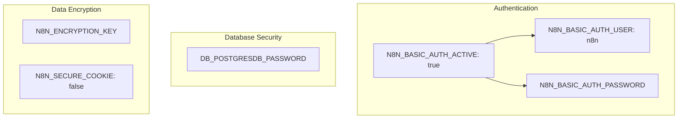

### Authentication Components
- `N8N_BASIC_AUTH_ACTIVE`: Enabled in configmap [n8n-configmap.yaml:22]()
- `N8N_BASIC_AUTH_USER`: Set to "n8n" in configmap [n8n-configmap.yaml:23]()
- `N8N_BASIC_AUTH_PASSWORD`: Stored in secrets [n8n-secrets.yaml:15]()

### Data Protection
- `N8N_ENCRYPTION_KEY`: Used to encrypt all workflow data [n8n-secrets.yaml:17]()
- `DB_POSTGRESDB_PASSWORD`: Database authentication [n8n-secrets.yaml:13]()
- `N8N_SECURE_COOKIE`: Set to "false" for development [n8n-secrets.yaml:18]()

**Security Note**: All secret values in the example configuration use placeholder values that must be changed before production deployment [n8n-secrets.yaml:13,15,17]().


## Service Exposure

The `n8n-service` provides internal cluster networking for the application:

| Service Configuration | Value | Description |
|----------------------|-------|-------------|
| Service Type | ClusterIP | Internal cluster access only |
| Service Port | 8080 | External port for cluster communication |
| Target Port | 5678 | Container port mapping |
| Protocol | TCP | Network protocol |

The service uses label selectors to route traffic to pods with labels `app: n8n` and `component: deployment` [n8n-service.yaml:12-14]().

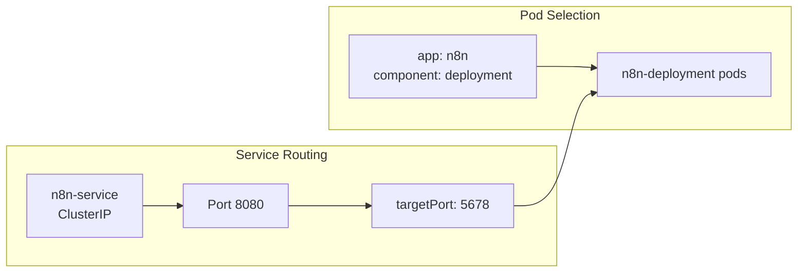


## Health Monitoring

The deployment implements comprehensive health monitoring through Kubernetes probes:

### Liveness Probe
- **Endpoint**: `/healthz` on port 5678 [n8n-deployment.yaml:32-33]()
- **Purpose**: Determines if the container needs to be restarted
- **Protocol**: HTTP GET request

### Readiness Probe  
- **Endpoint**: `/healthz` on port 5678 [n8n-deployment.yaml:35-36]()
- **Purpose**: Determines if the pod is ready to receive traffic
- **Protocol**: HTTP GET request

Both probes use the same endpoint, which is provided by the n8n application for health status reporting.


## Resource Management

The deployment specifies resource requirements to ensure predictable performance and enable horizontal pod autoscaling:

### Resource Allocation
- **CPU Requests**: 0.5 cores guaranteed allocation [n8n-deployment.yaml:43]()
- **CPU Limits**: 1.0 cores maximum consumption [n8n-deployment.yaml:40]()
- **Memory Requests**: 512Mi guaranteed allocation [n8n-deployment.yaml:44]()
- **Memory Limits**: 1024Mi maximum consumption [n8n-deployment.yaml:41]()

These resource specifications support the autoscaling configuration that can scale the application from 1 to 5 replicas based on CPU utilization thresholds defined in the HPA controller (see [Auto-scaling Configuration](#5.1)).

# n8n Workers
<details>
<summary>Relevant source files</summary>

The following files were used as context for generating this wiki page:

- [n8n-worker/n8n-worker-configmap.yaml](n8n-worker/n8n-worker-configmap.yaml)
- [n8n-worker/n8n-worker-deployment.yml](n8n-worker/n8n-worker-deployment.yml)
- [n8n-worker/n8n-worker-secrets.yaml](n8n-worker/n8n-worker-secrets.yaml)
- [n8n-worker/n8n-worker-service.yml](n8n-worker/n8n-worker-service.yml)

</details>


## Purpose and Scope

This document covers the n8n worker deployment which provides distributed workflow execution capabilities for the n8n automation platform. Workers are separate processes that consume workflow execution jobs from a Redis queue, enabling horizontal scaling of workflow processing beyond the main n8n application.

For information about the main n8n application that orchestrates workflows and provides the web interface, see [n8n Application](#3.1). For details about the Redis queue system that connects workers to the main application, see [Cache and Queue Layer](#3.4).

## Worker Architecture in the Distributed System

The n8n workers operate as part of a queue-based distributed execution system where the main n8n application delegates workflow execution to dedicated worker processes.

### Worker Component Architecture

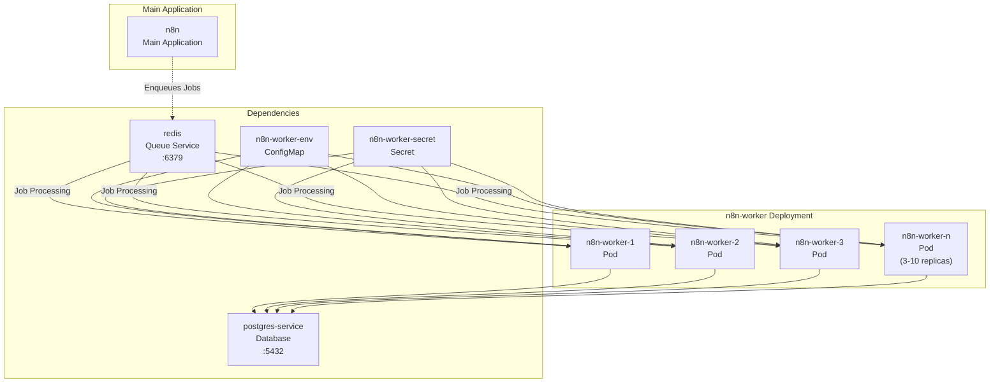


### Worker Command and Execution Mode

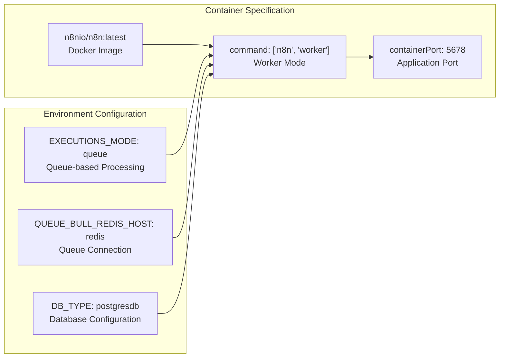


## Configuration Management

### Environment Variables via ConfigMap

The `n8n-worker-env` ConfigMap defines the core operational parameters for worker processes:

| Variable | Value | Purpose |
|----------|-------|---------|
| `QUEUE_BULL_REDIS_HOST` | `redis` | Redis service name for queue connection |
| `QUEUE_BULL_REDIS_PORT` | `6379` | Redis port for queue communication |
| `EXECUTIONS_MODE` | `queue` | Enables queue-based execution mode |
| `DB_TYPE` | `postgresdb` | Database type specification |
| `DB_POSTGRESDB_HOST` | `postgres-service` | PostgreSQL service name |
| `DB_POSTGRESDB_PORT` | `5432` | PostgreSQL connection port |
| `DB_POSTGRESDB_DATABASE` | `n8n` | Database name |
| `DB_POSTGRESDB_USER` | `n8n` | Database username |


### Secret Management

The `n8n-worker-secret` provides sensitive configuration data:

- **`N8N_ENCRYPTION_KEY`**: Used for encrypting sensitive workflow data and credentials
- **`DB_POSTGRESDB_PASSWORD`**: PostgreSQL database password for authentication


## Deployment Specification

### Pod Template and Scaling

The worker deployment is configured for horizontal scaling with the following characteristics:

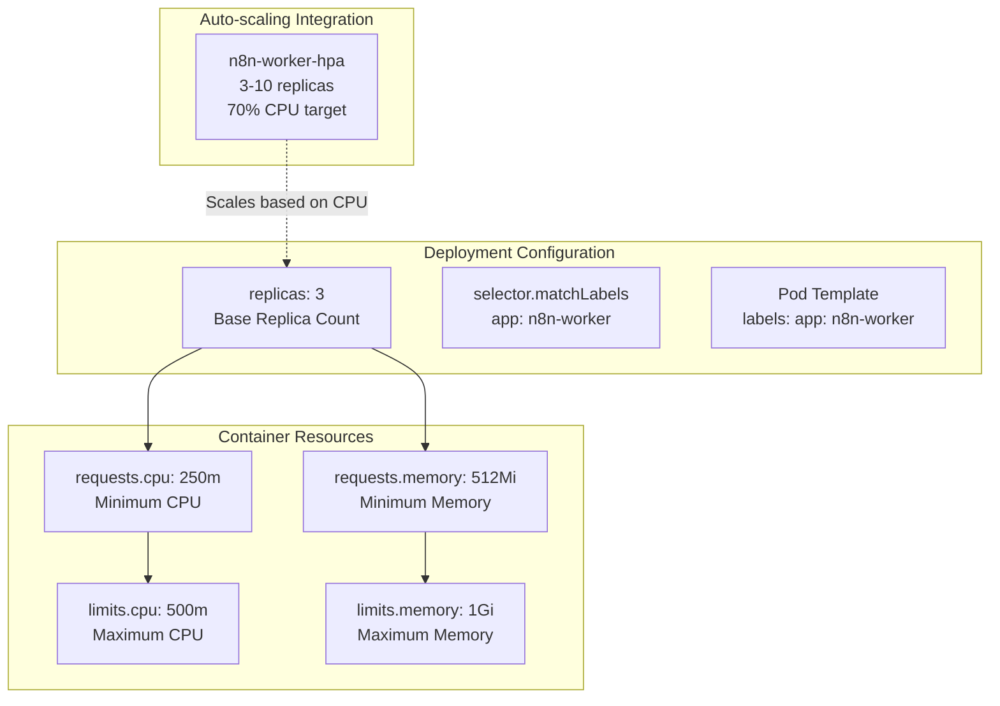


### Resource Allocation

Worker pods are configured with conservative resource allocation suitable for workflow execution tasks:

- **CPU Requests**: `250m` (0.25 cores) - guaranteed minimum
- **CPU Limits**: `500m` (0.5 cores) - maximum allowed
- **Memory Requests**: `512Mi` - guaranteed minimum
- **Memory Limits**: `1Gi` - maximum allowed

This allocation allows for 2-4 workers per CPU core depending on workload characteristics.


## Service Definition

### Network Exposure

The `n8n-worker` service provides internal cluster networking for worker pods:

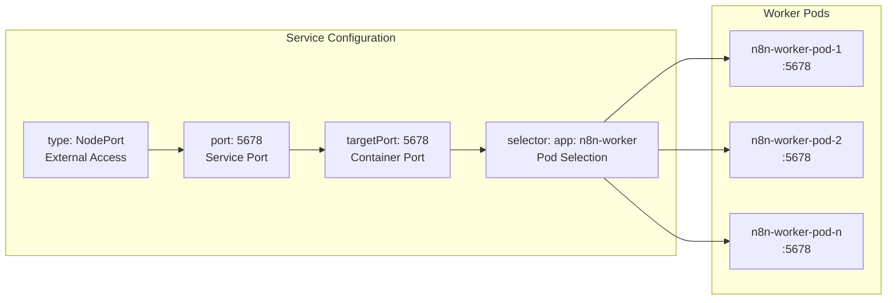


## Integration with System Components

### Database Connection

Workers connect directly to the PostgreSQL database to:
- Read workflow definitions and execution history
- Store execution results and logs
- Access credential and environment data

Connection parameters are inherited from the main application configuration to ensure consistency.

### Queue Processing

Workers implement the Bull/Redis queue consumer pattern:
1. Connect to Redis service on port `6379`
2. Subscribe to workflow execution queues
3. Process jobs asynchronously
4. Report execution status back through the database

### Shared State Management

Workers share the same encryption key (`N8N_ENCRYPTION_KEY`) as the main application to ensure:
- Consistent credential decryption
- Secure handling of sensitive workflow data
- Compatibility with existing workflow configurations

# Database Layer
<details>
<summary>Relevant source files</summary>

The following files were used as context for generating this wiki page:

- [db/postgres-secrets.yaml](db/postgres-secrets.yaml)
- [db/postgres-service.yaml](db/postgres-service.yaml)
- [db/postgres-statefulset.yaml](db/postgres-statefulset.yaml)

</details>


## Purpose and Scope

This document covers the PostgreSQL database deployment that provides persistent storage for the n8n workflow automation platform. The database layer stores workflow definitions, execution history, credentials, and other persistent application data required by both the main n8n application and worker processes.

For information about the Redis-based caching and queue layer, see [Cache and Queue Layer](#3.4). For details about how applications connect to the database, see [n8n Application](#3.1) and [n8n Workers](#3.2).

## PostgreSQL Architecture

The database layer consists of a PostgreSQL deployment running as a StatefulSet with persistent storage. This ensures data persistence across pod restarts and provides a reliable foundation for workflow data storage.

### Database Deployment Structure

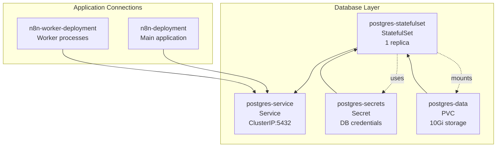


### Database Container Configuration

The PostgreSQL database runs using the `postgres:10` image within a StatefulSet configuration. The container is configured with environment variables sourced from Kubernetes secrets.

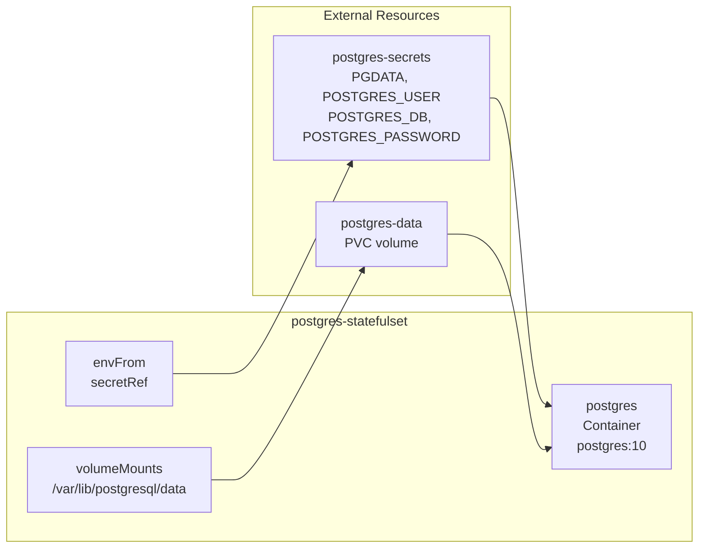


## Database Configuration

### Connection Parameters

The database is configured with the following specifications:

| Parameter | Value | Source |
|-----------|--------|---------|
| Database Name | `n8n` | [db/postgres-secrets.yaml:14]() |
| Username | `n8n` | [db/postgres-secrets.yaml:13]() |
| Password | `n8n` | [db/postgres-secrets.yaml:15]() |
| Data Directory | `/var/lib/postgresql/data/pgdata` | [db/postgres-secrets.yaml:12]() |
| Port | `5432` | [db/postgres-service.yaml:17-18]() |

### Service Exposure

The `postgres-service` exposes the database within the cluster using a ClusterIP service. This service provides a stable DNS endpoint for applications to connect to the database.

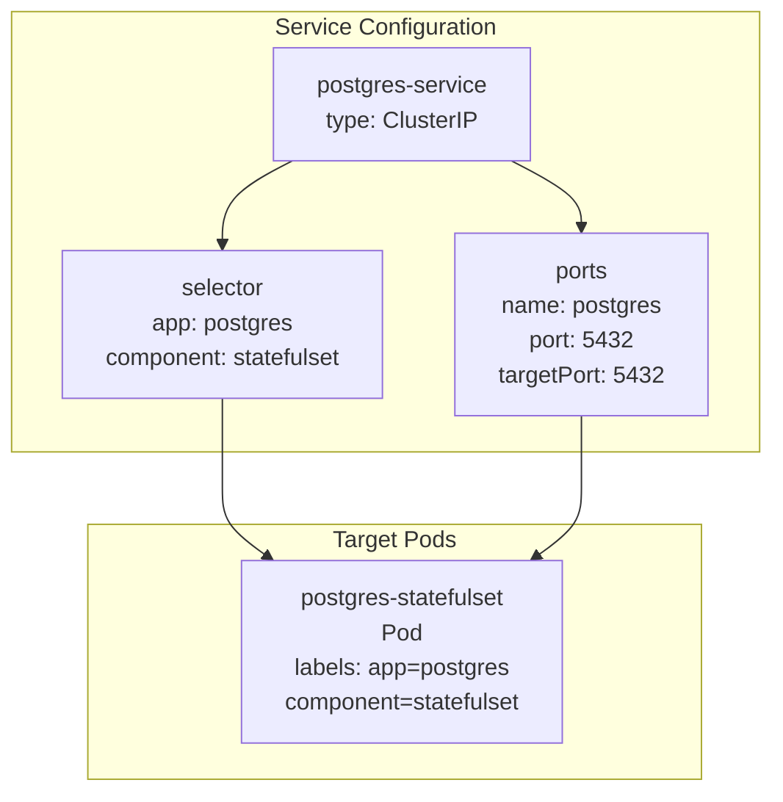


## Persistent Storage

### Volume Configuration

The StatefulSet uses `volumeClaimTemplates` to create persistent volumes for data storage. Each replica gets its own dedicated 10Gi persistent volume.

| Storage Attribute | Value |
|-------------------|-------|
| Access Mode | `ReadWriteOnce` |
| Storage Size | `10Gi` |
| Mount Path | `/var/lib/postgresql/data` |
| Volume Name | `postgres-data` |

### Data Persistence

The PostgreSQL data directory is mounted from a persistent volume claim, ensuring that workflow data, execution history, and application state survive pod restarts and rescheduling.

```mermaid
graph TB
    subgraph "Storage Layer"
        VCT["volumeClaimTemplates<br/>postgres-data<br/>10Gi ReadWriteOnce"]
        PVC["PersistentVolumeClaim<br/>postgres-data"]
        PV["PersistentVolume<br/>Cluster storage"]
    end
    
    subgraph "Application Layer"
        POD["postgres Pod"]
        MOUNT["Volume Mount<br/>/var/lib/postgresql/data"]
        PGDATA["PGDATA<br/>/var/lib/postgresql/data/pgdata"]
    end
    
    VCT --> PVC
    PVC --> PV
    PV --> MOUNT
    MOUNT --> POD
    MOUNT --> PGDATA
```


## Database Specifications

### Resource Allocation

The PostgreSQL StatefulSet is configured as a single-replica deployment optimized for consistency rather than horizontal scaling. The database container runs without explicit resource limits, allowing it to utilize available cluster resources.

### Network Connectivity

Applications connect to the database using the service name `postgres-service` on port `5432`. The service selector ensures traffic is routed to pods with labels `app: postgres` and `component: statefulset`.

### Security Configuration

Database credentials are managed through the `postgres-secrets` Secret resource, which provides environment variables to the PostgreSQL container. The secret contains:

- `POSTGRES_USER`: Database username
- `POSTGRES_DB`: Database name  
- `POSTGRES_PASSWORD`: Database password
- `PGDATA`: Custom data directory path

# Cache and Queue Layer
<details>
<summary>Relevant source files</summary>

The following files were used as context for generating this wiki page:

- [redis/redis-deployment.yml](redis/redis-deployment.yml)
- [redis/redis-hpa.yaml](redis/redis-hpa.yaml)
- [redis/redis-service.yml](redis/redis-service.yml)

</details>


This document covers the Redis deployment that serves as both the caching and message queue system for the n8n workflow automation platform. Redis enables distributed workflow execution by providing job queuing capabilities and temporary data storage.

For database persistence and storage of workflows, see [Database Layer](#3.3). For worker processes that consume jobs from the queue, see [n8n Workers](#3.2).

## Redis Architecture Overview

Redis functions as the central messaging and caching backbone that connects the n8n main application with worker processes. It handles job distribution, temporary workflow data, and provides high-performance caching for the distributed n8n system.

```mermaid
graph TB
    subgraph "n8n Application Layer"
        N8N_MAIN["n8n Main Application"]
        N8N_WORKERS["n8n Workers (3-10 replicas)"]
    end
    
    subgraph "Redis Cache and Queue Layer"
        REDIS_POD["Redis Pod(s)"]
        REDIS_SVC["redis Service (6379)"]
    end
    
    subgraph "Queue Operations"
        JOB_QUEUE["Job Queue"]
        CACHE_DATA["Cache Data"]
        SESSION_DATA["Session Data"]
    end
    
    N8N_MAIN -->|"Enqueue Jobs"| REDIS_SVC
    N8N_MAIN -->|"Cache/Session"| REDIS_SVC
    REDIS_SVC --> REDIS_POD
    REDIS_POD --> JOB_QUEUE
    REDIS_POD --> CACHE_DATA
    REDIS_POD --> SESSION_DATA
    REDIS_SVC -->|"Dequeue Jobs"| N8N_WORKERS
    REDIS_SVC -->|"Cache Access"| N8N_WORKERS
```

**Sources:** [redis/redis-deployment.yml:1-32](), [redis/redis-service.yml:1-12]()

## Deployment Configuration

The Redis deployment uses a standard Redis container with resource constraints and scaling capabilities. The deployment is configured to run in the `n8n` namespace alongside other system components.

```mermaid
graph TB
    subgraph "Redis Deployment Structure"
        DEPLOYMENT["redis Deployment"]
        POD_TEMPLATE["Pod Template"]
        CONTAINER["redis Container"]
        RESOURCES["Resource Limits"]
    end
    
    subgraph "Container Configuration"
        IMAGE["redis:latest"]
        PORT["containerPort: 6379"]
        CPU_REQ["CPU Request: 100m"]
        MEM_REQ["Memory Request: 128Mi"]
        CPU_LIM["CPU Limit: 500m"]
        MEM_LIM["Memory Limit: 512Mi"]
    end
    
    DEPLOYMENT --> POD_TEMPLATE
    POD_TEMPLATE --> CONTAINER
    CONTAINER --> IMAGE
    CONTAINER --> PORT
    CONTAINER --> RESOURCES
    RESOURCES --> CPU_REQ
    RESOURCES --> MEM_REQ
    RESOURCES --> CPU_LIM
    RESOURCES --> MEM_LIM
```

**Sources:** [redis/redis-deployment.yml:1-32]()

### Key Configuration Details

| Configuration | Value | Purpose |
|---------------|-------|---------|
| Image | `redis:latest` | Standard Redis container |
| Namespace | `n8n` | Isolated deployment environment |
| Replicas | `1` | Initial deployment size |
| Container Port | `6379` | Standard Redis port |
| CPU Request | `100m` | Minimum CPU allocation |
| Memory Request | `128Mi` | Minimum memory allocation |
| CPU Limit | `500m` | Maximum CPU allocation |
| Memory Limit | `512Mi` | Maximum memory allocation |

**Sources:** [redis/redis-deployment.yml:6](), [redis/redis-deployment.yml:10](), [redis/redis-deployment.yml:22-30]()

## Auto-scaling Configuration

Redis includes horizontal pod autoscaling to handle varying queue loads and cache demands. The HPA monitors CPU utilization and scales the deployment between 1 and 5 replicas.

```mermaid
graph TB
    subgraph "HPA Configuration"
        HPA["redis-hpa"]
        TARGET["scaleTargetRef: redis Deployment"]
        METRICS["CPU Utilization Metrics"]
    end
    
    subgraph "Scaling Parameters"
        MIN_REP["minReplicas: 1"]
        MAX_REP["maxReplicas: 5"]
        CPU_TARGET["averageUtilization: 70%"]
    end
    
    subgraph "Scaling Behavior"
        SCALE_UP["Scale Up when CPU > 70%"]
        SCALE_DOWN["Scale Down when CPU < 70%"]
        REPLICA_RANGE["1-5 Redis Pods"]
    end
    
    HPA --> TARGET
    HPA --> METRICS
    METRICS --> MIN_REP
    METRICS --> MAX_REP
    METRICS --> CPU_TARGET
    
    CPU_TARGET --> SCALE_UP
    CPU_TARGET --> SCALE_DOWN
    SCALE_UP --> REPLICA_RANGE
    SCALE_DOWN --> REPLICA_RANGE
```

**Sources:** [redis/redis-hpa.yaml:1-21]()

The HPA configuration targets the `redis` deployment [redis/redis-hpa.yaml:8-11]() and uses CPU utilization as the scaling metric [redis/redis-hpa.yaml:14-20](). This ensures Redis can handle increased queue processing demands during peak workflow execution periods.

## Service Configuration

The Redis service exposes the Redis deployment within the cluster using a NodePort service type. This enables both n8n main application and worker pods to access the Redis instance for queue operations and caching.

```mermaid
graph TB
    subgraph "Service Configuration"
        SVC["redis Service"]
        SELECTOR["app: redis selector"]
        PORT_CONFIG["Port Configuration"]
    end
    
    subgraph "Port Mapping"
        SERVICE_PORT["Service Port: 6379"]
        TARGET_PORT["Target Port: 6379"]
        NODE_PORT["NodePort Type"]
    end
    
    subgraph "Client Access"
        N8N_APP["n8n Application Pods"]
        WORKER_PODS["n8n Worker Pods"]
        EXTERNAL_ACCESS["External Redis Clients"]
    end
    
    SVC --> SELECTOR
    SVC --> PORT_CONFIG
    PORT_CONFIG --> SERVICE_PORT
    PORT_CONFIG --> TARGET_PORT
    PORT_CONFIG --> NODE_PORT
    
    N8N_APP --> SVC
    WORKER_PODS --> SVC
    EXTERNAL_ACCESS --> SVC
```

**Sources:** [redis/redis-service.yml:1-12]()

The service uses the `app: redis` selector [redis/redis-service.yml:8-9]() to route traffic to Redis pods and exposes port 6379 [redis/redis-service.yml:11-12]() for standard Redis protocol communication.

## Cache and Queue Operations

Redis supports multiple data patterns within the n8n system, serving as both a message queue for job distribution and a cache for temporary workflow data.

### Queue Operations Flow

```mermaid
sequenceDiagram
    participant N8N as "n8n Main App"
    participant REDIS as "Redis Service"
    participant WORKER as "n8n Worker"
    
    N8N->>REDIS: "LPUSH job_queue {workflow_data}"
    REDIS-->>N8N: "OK"
    
    WORKER->>REDIS: "BRPOP job_queue timeout"
    REDIS-->>WORKER: "{workflow_data}"
    
    WORKER->>REDIS: "SET job_status_{id} processing"
    REDIS-->>WORKER: "OK"
    
    WORKER->>REDIS: "SET job_result_{id} {result}"
    REDIS-->>WORKER: "OK"
    
    N8N->>REDIS: "GET job_result_{id}"
    REDIS-->>N8N: "{result}"
```

**Sources:** Referenced from system architecture diagrams and Redis deployment configuration

### Data Types and Usage

| Data Pattern | Redis Structure | Purpose |
|--------------|-----------------|---------|
| Job Queue | Lists (`LPUSH`/`BRPOP`) | Workflow job distribution |
| Job Status | Strings (`SET`/`GET`) | Execution state tracking |
| Session Cache | Hash Maps | User session data |
| Workflow Cache | Strings with TTL | Temporary workflow results |
| Execution Metrics | Sorted Sets | Performance monitoring |

## Resource Management

Redis resource allocation is designed to handle typical n8n workloads while providing room for scaling during high-demand periods.

### Resource Allocation Strategy

```mermaid
graph TB
    subgraph "Resource Planning"
        BASE_LOAD["Base Load (1 replica)"]
        SCALE_LOAD["Scaled Load (up to 5 replicas)"]
        TOTAL_CAPACITY["Total System Capacity"]
    end
    
    subgraph "Per-Pod Resources"
        CPU_REQ["100m CPU request"]
        MEM_REQ["128Mi memory request"]
        CPU_LIM["500m CPU limit"]
        MEM_LIM["512Mi memory limit"]
    end
    
    subgraph "Scaling Thresholds"
        CPU_70["70% CPU utilization"]
        SCALE_UP_TRIGGER["Scale up trigger"]
        SCALE_DOWN_TRIGGER["Scale down trigger"]
    end
    
    BASE_LOAD --> CPU_REQ
    BASE_LOAD --> MEM_REQ
    SCALE_LOAD --> CPU_LIM
    SCALE_LOAD --> MEM_LIM
    
    CPU_70 --> SCALE_UP_TRIGGER
    CPU_70 --> SCALE_DOWN_TRIGGER
    SCALE_UP_TRIGGER --> TOTAL_CAPACITY
    SCALE_DOWN_TRIGGER --> BASE_LOAD
```

**Sources:** [redis/redis-deployment.yml:24-30](), [redis/redis-hpa.yaml:12-20]()

The resource configuration ensures Redis can handle queue operations efficiently while maintaining headroom for scaling. The memory allocation of 128Mi-512Mi per pod provides sufficient space for job queues and cache data, while CPU limits ensure responsive job processing.1f:T1800,# External Access

<details>
<summary>Relevant source files</summary>

The following files were used as context for generating this wiki page:

- [Cloudflare/cloudflared-deployment.yml](Cloudflare/cloudflared-deployment.yml)
- [Cloudflare/cloudflared-secrets.yml](Cloudflare/cloudflared-secrets.yml)

</details>


## Purpose and Scope

This document covers the external access mechanism for the n8n Kubernetes deployment, specifically the Cloudflare tunnel implementation that provides secure external connectivity to the n8n application. This page focuses on the `cloudflared` deployment and its configuration for enabling internet access to the cluster-internal n8n services.

For information about internal cluster networking and service discovery, see [Service Discovery and Networking](#5.2). For n8n application configuration, see [n8n Application](#3.1). For secrets management related to the Cloudflare token, see [Secrets Management](#4.2).

## External Access Architecture

The external access layer provides secure connectivity from the internet to the n8n application running within the Kubernetes cluster. This is implemented using Cloudflare tunnels, which eliminate the need for traditional ingress controllers or load balancers with public IP addresses.

### External Access Flow

```mermaid
graph LR
    INTERNET["Internet Users"]
    CLOUDFLARE["Cloudflare Network"]
    TUNNEL["cloudflared-deployment"]
    N8N["n8n-service"]
    APP["n8n Application Pods"]
    
    INTERNET --> CLOUDFLARE
    CLOUDFLARE --> TUNNEL
    TUNNEL --> N8N
    N8N --> APP
    
    TUNNEL -.->|"Health Check"| METRICS["Metrics :2000"]
```


## Cloudflared Deployment

The `cloudflared` service runs as a Kubernetes Deployment that establishes outbound connections to Cloudflare's network, creating secure tunnels for inbound traffic.

### Deployment Configuration

```mermaid
graph TB
    subgraph "cloudflared-deployment"
        REPLICAS["replicas: 2"]
        SELECTOR["selector: pod=cloudflared"]
        
        subgraph "Pod Template"
            SECURITY["securityContext"]
            CONTAINER["cloudflared container"]
            ENV["Environment Variables"]
            PROBE["livenessProbe"]
        end
    end
    
    subgraph "Container Specs"
        IMAGE["image: cloudflare/cloudflared:latest"]
        COMMAND["command: cloudflared tunnel"]
        ARGS["args: --token $(API_TOKEN)"]
        METRICS_PORT["metrics: 0.0.0.0:2000"]
    end
    
    subgraph "Security & Health"
        SYSCTLS["net.ipv4.ping_group_range"]
        LIVENESS["httpGet: /ready:2000"]
    end
    
    CONTAINER --> IMAGE
    CONTAINER --> COMMAND
    CONTAINER --> ARGS
    CONTAINER --> METRICS_PORT
    SECURITY --> SYSCTLS
    PROBE --> LIVENESS
```

The deployment is configured with the following key specifications:

| Component | Configuration | Purpose |
|-----------|---------------|---------|
| Replicas | `2` | High availability with redundant tunnel connections |
| Image | `cloudflare/cloudflared:latest` | Official Cloudflare tunnel client |
| Command | `cloudflared tunnel --no-autoupdate --metrics 0.0.0.0:2000 run` | Tunnel mode with metrics endpoint |
| Security Context | `net.ipv4.ping_group_range: "65532 65532"` | Network permissions for tunnel operation |


### Secret Configuration

The `cloudflared` deployment requires authentication to Cloudflare services through an API token stored as a Kubernetes Secret.

```mermaid
graph LR
    SECRET["cloudflared-token Secret"]
    TOKEN_KEY["token key"]
    ENV_VAR["API_TOKEN env var"]
    CONTAINER["cloudflared container"]
    
    SECRET --> TOKEN_KEY
    TOKEN_KEY --> ENV_VAR
    ENV_VAR --> CONTAINER
    
    SECRET -.->|"namespace: n8n"| NS["n8n namespace"]
    SECRET -.->|"type: Opaque"| TYPE["Base64 encoded"]
```

The secret configuration maps the Cloudflare token to the container environment:

- **Secret Name**: `cloudflared-token`
- **Key**: `token`
- **Environment Variable**: `API_TOKEN`
- **Usage**: Passed as `--token $(API_TOKEN)` argument to the `cloudflared` command


## Health Monitoring

The `cloudflared` deployment includes health monitoring capabilities to ensure tunnel connectivity and service availability.

### Liveness Probe Configuration

The deployment implements a liveness probe that monitors the tunnel status:

| Parameter | Value | Purpose |
|-----------|-------|---------|
| Path | `/ready` | Health check endpoint |
| Port | `2000` | Metrics and health port |
| Initial Delay | `10` seconds | Startup grace period |
| Period | `10` seconds | Check interval |
| Failure Threshold | `1` | Immediate restart on failure |

The metrics endpoint on port `2000` provides monitoring data and serves the `/ready` health check endpoint used by Kubernetes to determine pod health.


## Security Considerations

The external access implementation incorporates several security measures:

1. **Outbound-Only Connections**: The `cloudflared` tunnel establishes outbound connections to Cloudflare, eliminating the need for inbound firewall rules or public IP addresses.

2. **Token-Based Authentication**: Access is secured through the Cloudflare API token stored in Kubernetes Secrets with base64 encoding.

3. **Network Isolation**: The tunnel operates within the `n8n` namespace, providing network isolation from other cluster workloads.

4. **Sysctls Configuration**: Specific network sysctls are configured to enable proper tunnel operation while maintaining security boundaries.

# Configuration Management
<details>
<summary>Relevant source files</summary>

The following files were used as context for generating this wiki page:

- [n8n-configmap.yaml](n8n-configmap.yaml)
- [n8n-secrets.yaml](n8n-secrets.yaml)

</details>


This page provides an overview of how configuration and secrets are managed across the n8n Kubernetes deployment. It covers the structure and organization of ConfigMaps and Secrets that provide runtime configuration to all system components.

For detailed information about specific application configurations, see [Application Configuration](#4.1). For security-related credential management, see [Secrets Management](#4.2).

## Configuration Architecture

The n8n-k8s deployment uses Kubernetes-native configuration management through ConfigMaps for non-sensitive settings and Secrets for sensitive data. This approach provides clear separation between public configuration and private credentials while maintaining centralized management.

### Configuration Flow Diagram

```mermaid
graph TB
    subgraph "Configuration Sources"
        n8n_configmap["n8n-configmap"]
        n8n_worker_configmap["n8n-worker-configmap"]
        n8n_secrets["n8n-secrets"]
        n8n_worker_secrets["n8n-worker-secrets"]
        postgres_secrets["postgres-secrets"]
        cloudflared_secrets["cloudflared-secrets"]
    end
    
    subgraph "Application Pods"
        n8n_app["n8n Application Pod"]
        n8n_workers["n8n Worker Pods"]
        postgres_pod["PostgreSQL Pod"]
        cloudflared_pod["Cloudflared Pod"]
    end
    
    n8n_configmap --> n8n_app
    n8n_secrets --> n8n_app
    n8n_worker_configmap --> n8n_workers
    n8n_worker_secrets --> n8n_workers
    postgres_secrets --> postgres_pod
    cloudflared_secrets --> cloudflared_pod
```


## Configuration Structure

The configuration management follows a component-based approach where each major system component has dedicated ConfigMaps and Secrets. This structure enables independent configuration updates and clear ownership boundaries.

### Configuration Data Organization

```mermaid
graph LR
    subgraph "n8n-configmap Data"
        node_env["NODE_ENV"]
        timezone["GENERIC_TIMEZONE"]
        webhook_config["WEBHOOK_TUNNEL_URL<br/>WEBHOOK_URL"]
        db_config["DB_TYPE<br/>DB_POSTGRESDB_USER<br/>DB_POSTGRESDB_DATABASE<br/>DB_POSTGRESDB_HOST<br/>DB_POSTGRESDB_PORT"]
        auth_config["N8N_BASIC_AUTH_ACTIVE<br/>N8N_BASIC_AUTH_USER"]
        queue_config["EXECUTIONS_MODE<br/>QUEUE_BULL_REDIS_HOST<br/>QUEUE_BULL_REDIS_PORT<br/>N8N_RUNNERS_ENABLED<br/>OFFLOAD_MANUAL_EXECUTIONS_TO_WORKERS"]
    end
    
    subgraph "n8n-secrets Data"
        db_password["DB_POSTGRESDB_PASSWORD"]
        auth_password["N8N_BASIC_AUTH_PASSWORD"]
        encryption_key["N8N_ENCRYPTION_KEY"]
        secure_cookie["N8N_SECURE_COOKIE"]
    end
```


## Configuration Categories

The configuration data is organized into logical categories that align with system functionality:

| Category | ConfigMap Keys | Secret Keys | Purpose |
|----------|----------------|-------------|---------|
| Environment | `NODE_ENV`, `GENERIC_TIMEZONE` | - | Runtime environment settings |
| Database | `DB_TYPE`, `DB_POSTGRESDB_*` | `DB_POSTGRESDB_PASSWORD` | PostgreSQL connection configuration |
| Webhooks | `WEBHOOK_TUNNEL_URL`, `WEBHOOK_URL` | - | External webhook endpoint configuration |
| Authentication | `N8N_BASIC_AUTH_ACTIVE`, `N8N_BASIC_AUTH_USER` | `N8N_BASIC_AUTH_PASSWORD` | Basic authentication settings |
| Queue System | `EXECUTIONS_MODE`, `QUEUE_BULL_REDIS_*` | - | Redis queue configuration |
| Security | - | `N8N_ENCRYPTION_KEY`, `N8N_SECURE_COOKIE` | Encryption and security settings |


## Configuration Injection Pattern

The system uses environment variable injection to provide configuration data to application containers. ConfigMaps supply non-sensitive settings while Secrets provide encrypted storage for credentials and keys.

### Environment Variable Mapping

```mermaid
graph TB
    subgraph "Kubernetes Resources"
        configmap_resource["n8n-configmap<br/>(ConfigMap)"]
        secrets_resource["n8n-secrets<br/>(Secret)"]
    end
    
    subgraph "Container Environment"
        env_vars["Environment Variables:<br/>NODE_ENV=production<br/>DB_POSTGRESDB_HOST=postgres-service<br/>WEBHOOK_URL=https://kube.1o1.zip/<br/>N8N_BASIC_AUTH_PASSWORD=***<br/>N8N_ENCRYPTION_KEY=***"]
    end
    
    subgraph "Application Process"
        n8n_process["n8n Application"]
    end
    
    configmap_resource --> env_vars
    secrets_resource --> env_vars
    env_vars --> n8n_process
```


## Database Configuration

Database connectivity is configured through a combination of ConfigMap and Secret values. The ConfigMap contains connection parameters while the Secret stores the database password.

**ConfigMap Database Settings:**
- `DB_TYPE`: Set to `"postgresdb"` [n8n-configmap.yaml:16]()
- `DB_POSTGRESDB_USER`: Database username `"n8n"` [n8n-configmap.yaml:17]()
- `DB_POSTGRESDB_DATABASE`: Database name `"n8n"` [n8n-configmap.yaml:18]()
- `DB_POSTGRESDB_HOST`: Service name `"postgres-service"` [n8n-configmap.yaml:19]()
- `DB_POSTGRESDB_PORT`: Port number `"5432"` [n8n-configmap.yaml:20]()

**Secret Database Settings:**
- `DB_POSTGRESDB_PASSWORD`: Database password [n8n-secrets.yaml:13]()


## Queue and Worker Configuration

The system uses Redis for job queuing with configuration split between queue connection settings and execution mode parameters.

**Queue Configuration:**
- `EXECUTIONS_MODE`: Set to `"queue"` for distributed processing [n8n-configmap.yaml:25]()
- `QUEUE_BULL_REDIS_HOST`: Redis service name `"redis"` [n8n-configmap.yaml:26]()
- `QUEUE_BULL_REDIS_PORT`: Redis port `"6379"` [n8n-configmap.yaml:27]()
- `N8N_RUNNERS_ENABLED`: Enables worker mode [n8n-configmap.yaml:24]()
- `OFFLOAD_MANUAL_EXECUTIONS_TO_WORKERS`: Distributes manual executions [n8n-configmap.yaml:28]()


## Security Configuration

Security settings are primarily stored in Secrets to protect sensitive authentication and encryption data.

**Authentication Settings:**
- `N8N_BASIC_AUTH_ACTIVE`: Enables basic authentication [n8n-configmap.yaml:22]()
- `N8N_BASIC_AUTH_USER`: Username for basic auth [n8n-configmap.yaml:23]()
- `N8N_BASIC_AUTH_PASSWORD`: Password for basic auth [n8n-secrets.yaml:15]()

**Encryption Settings:**
- `N8N_ENCRYPTION_KEY`: Key for data encryption [n8n-secrets.yaml:17]()
- `N8N_SECURE_COOKIE`: Cookie security flag [n8n-secrets.yaml:18]()

# Application Configuration
<details>
<summary>Relevant source files</summary>

The following files were used as context for generating this wiki page:

- [n8n-configmap.yaml](n8n-configmap.yaml)
- [n8n-worker/n8n-worker-configmap.yaml](n8n-worker/n8n-worker-configmap.yaml)

</details>


This document details the ConfigMap-based configuration system used to configure the n8n application and worker components in the Kubernetes deployment. ConfigMaps contain non-sensitive configuration data that defines application behavior, database connections, queue settings, and external service endpoints.

For sensitive configuration data such as passwords and API keys, see [Secrets Management](#4.2). For details about the applications themselves, see [n8n Application](#3.1) and [n8n Workers](#3.2).

## Configuration Architecture

The n8n system uses two primary ConfigMaps to manage application configuration across the distributed deployment:

```mermaid
graph TB
    subgraph "ConfigMaps"
        N8N_CM["n8n-configmap"]
        WORKER_CM["n8n-worker-env"]
    end
    
    subgraph "Deployments"
        N8N_DEP["n8n-deployment"]
        WORKER_DEP["n8n-worker-deployment"]
    end
    
    subgraph "External Services"
        POSTGRES["postgres-service:5432"]
        REDIS["redis:6379"]
        WEBHOOK["kube.1o1.zip"]
    end
    
    N8N_CM --> N8N_DEP
    WORKER_CM --> WORKER_DEP
    
    N8N_DEP --> POSTGRES
    N8N_DEP --> REDIS
    N8N_DEP --> WEBHOOK
    
    WORKER_DEP --> POSTGRES
    WORKER_DEP --> REDIS
```


## Main Application Configuration

The `n8n-configmap` ConfigMap provides configuration for the primary n8n application deployment. This ConfigMap is referenced by the main n8n pods and contains settings for production operation, database connectivity, queue management, and external webhook endpoints.

### Environment and Operational Settings

| Configuration Key | Value | Purpose |
|------------------|-------|---------|
| `NODE_ENV` | `production` | Sets Node.js environment mode |
| `GENERIC_TIMEZONE` | `Europe/Warsaw` | Default timezone for workflows |
| `N8N_BASIC_AUTH_ACTIVE` | `true` | Enables basic authentication |
| `N8N_BASIC_AUTH_USER` | `n8n` | Basic auth username |


### Database Configuration

The database configuration section establishes connectivity to the PostgreSQL service for persistent workflow and execution data storage:

```mermaid
graph LR
    N8N_CM["n8n-configmap"] --> DB_CONFIG["Database Config"]
    DB_CONFIG --> DB_TYPE["DB_TYPE: postgresdb"]
    DB_CONFIG --> DB_HOST["DB_POSTGRESDB_HOST: postgres-service"]
    DB_CONFIG --> DB_PORT["DB_POSTGRESDB_PORT: 5432"]
    DB_CONFIG --> DB_DATABASE["DB_POSTGRESDB_DATABASE: n8n"]
    DB_CONFIG --> DB_USER["DB_POSTGRESDB_USER: n8n"]
    
    DB_CONFIG --> POSTGRES_SVC["postgres-service"]
```


### Queue and Worker Configuration

The queue configuration enables distributed workflow execution by configuring Redis as the message broker and enabling worker mode:

| Configuration Key | Value | Purpose |
|------------------|-------|---------|
| `N8N_RUNNERS_ENABLED` | `true` | Enables worker runner functionality |
| `EXECUTIONS_MODE` | `queue` | Sets execution mode to queue-based |
| `QUEUE_BULL_REDIS_HOST` | `redis` | Redis service hostname |
| `QUEUE_BULL_REDIS_PORT` | `6379` | Redis service port |
| `OFFLOAD_MANUAL_EXECUTIONS_TO_WORKERS` | `true` | Routes manual executions to workers |


### Webhook Configuration

External webhook access is configured through Cloudflare tunnel endpoints:

| Configuration Key | Value | Purpose |
|------------------|-------|---------|
| `WEBHOOK_TUNNEL_URL` | `https://kube.1o1.zip/` | External webhook tunnel endpoint |
| `WEBHOOK_URL` | `https://kube.1o1.zip/` | External webhook base URL |


## Worker Configuration

The `n8n-worker-env` ConfigMap provides configuration specifically for worker instances that execute workflows from the job queue. Worker configuration focuses on queue connectivity and database access without requiring webhook or authentication settings.

```mermaid
graph TB
    WORKER_CM["n8n-worker-env"] --> QUEUE_CONFIG["Queue Configuration"]
    WORKER_CM --> DB_CONFIG["Database Configuration"]
    
    QUEUE_CONFIG --> REDIS_HOST["QUEUE_BULL_REDIS_HOST: redis"]
    QUEUE_CONFIG --> REDIS_PORT["QUEUE_BULL_REDIS_PORT: 6379"]
    QUEUE_CONFIG --> EXEC_MODE["EXECUTIONS_MODE: queue"]
    
    DB_CONFIG --> DB_TYPE["DB_TYPE: postgresdb"]
    DB_CONFIG --> DB_HOST["DB_POSTGRESDB_HOST: postgres-service"]
    DB_CONFIG --> DB_PORT["DB_POSTGRESDB_PORT: 5432"]
    DB_CONFIG --> DB_DATABASE["DB_POSTGRESDB_DATABASE: n8n"]
    DB_CONFIG --> DB_USER["DB_POSTGRESDB_USER: n8n"]
```


### Worker-Specific Settings

The worker configuration is streamlined to include only settings necessary for queue processing and database access:

| Configuration Key | Value | Purpose |
|------------------|-------|---------|
| `EXECUTIONS_MODE` | `queue` | Enables queue-based execution processing |
| `QUEUE_BULL_REDIS_HOST` | `redis` | Redis service for job queue |
| `QUEUE_BULL_REDIS_PORT` | `6379` | Redis port configuration |


## Configuration Flow

The configuration flow demonstrates how ConfigMap data is consumed by the application deployments:

```mermaid
flowchart TD
    CM_CREATE["ConfigMap Creation"] --> ENV_INJECTION["Environment Variable Injection"]
    ENV_INJECTION --> APP_STARTUP["Application Startup"]
    APP_STARTUP --> CONFIG_VALIDATION["Configuration Validation"]
    CONFIG_VALIDATION --> SERVICE_CONNECTIONS["Service Connections"]
    
    subgraph "ConfigMap Sources"
        N8N_CM_FILE["n8n-configmap.yaml"]
        WORKER_CM_FILE["n8n-worker-configmap.yaml"]
    end
    
    subgraph "Target Applications"
        N8N_PODS["n8n application pods"]
        WORKER_PODS["n8n-worker pods"]
    end
    
    N8N_CM_FILE --> CM_CREATE
    WORKER_CM_FILE --> CM_CREATE
    
    SERVICE_CONNECTIONS --> N8N_PODS
    SERVICE_CONNECTIONS --> WORKER_PODS
```


## Configuration Categories

The ConfigMap configurations can be categorized by their functional purpose:

| Category | Main Application | Workers | Purpose |
|----------|-----------------|---------|---------|
| **Database** | ✓ | ✓ | PostgreSQL connectivity |
| **Queue/Redis** | ✓ | ✓ | Job queue and caching |
| **Webhooks** | ✓ | ✗ | External endpoint configuration |
| **Authentication** | ✓ | ✗ | Basic auth settings |
| **Environment** | ✓ | ✗ | Runtime and timezone settings |
| **Worker Mode** | ✓ | ✓ | Distributed execution settings |

# Secrets Management
<details>
<summary>Relevant source files</summary>

The following files were used as context for generating this wiki page:

- [Cloudflare/cloudflared-secrets.yml](Cloudflare/cloudflared-secrets.yml)
- [db/postgres-secrets.yaml](db/postgres-secrets.yaml)
- [n8n-secrets.yaml](n8n-secrets.yaml)
- [n8n-worker/n8n-worker-secrets.yaml](n8n-worker/n8n-worker-secrets.yaml)

</details>


This document covers the management of sensitive data within the n8n Kubernetes deployment. It details the Secret resources used to store credentials, API tokens, and encryption keys required by the various components in the system.

For information about non-sensitive configuration data, see [Application Configuration](#4.1). For details about accessing and using the deployed n8n instance, see [Accessing and Using n8n](#6.3).

## Overview

The n8n-k8s deployment uses Kubernetes Secret resources to manage sensitive data across four main categories: database credentials, application authentication, encryption keys, and external service tokens. Each component has dedicated secrets that are mounted as environment variables into the respective pods.

## Secret Resources Architecture

The secrets management system is organized around component boundaries, with each major service having its own dedicated Secret resource. This provides isolation and follows the principle of least privilege access.

### Secrets Distribution Diagram

```mermaid
graph TB
    subgraph "Secret Resources"
        CF_SECRET["cloudflared-token"]
        PG_SECRET["postgres-secrets"]
        N8N_SECRET["n8n-secrets"]
        WORKER_SECRET["n8n-worker-secret"]
    end
    
    subgraph "Application Components"
        CLOUDFLARED["cloudflared-deployment"]
        POSTGRES["postgres-statefulset"]
        N8N_APP["n8n-deployment"]
        N8N_WORKERS["n8n-worker-deployment"]
    end
    
    CF_SECRET --> CLOUDFLARED
    PG_SECRET --> POSTGRES
    N8N_SECRET --> N8N_APP
    WORKER_SECRET --> N8N_WORKERS
    
    N8N_SECRET -.-> N8N_WORKERS
    PG_SECRET -.-> N8N_APP
    PG_SECRET -.-> N8N_WORKERS
```


## Database Secrets

The PostgreSQL database credentials are managed through the `postgres-secrets` Secret resource, which contains both authentication data and database configuration parameters.

### postgres-secrets Configuration

| Key | Purpose | Default Value |
|-----|---------|---------------|
| `PGDATA` | PostgreSQL data directory path | `/var/lib/postgresql/data/pgdata` |
| `POSTGRES_USER` | Database username | `n8n` |
| `POSTGRES_DB` | Database name | `n8n` |
| `POSTGRES_PASSWORD` | Database password | `n8n` |

The secret is defined using `stringData` for clear text values that are automatically base64-encoded by Kubernetes. The resource includes appropriate labels for component identification and is scoped to the `n8n` namespace.


## Application Secrets

The main n8n application requires multiple types of sensitive data for database connectivity, user authentication, and data encryption. These are consolidated in the `n8n-secrets` Secret resource.

### n8n-secrets Configuration

| Key | Purpose | Security Note |
|-----|---------|---------------|
| `DB_POSTGRESDB_PASSWORD` | Database connection password | Must match `postgres-secrets.POSTGRES_PASSWORD` |
| `N8N_BASIC_AUTH_PASSWORD` | Web interface authentication | Change from default `n8n` value |
| `N8N_ENCRYPTION_KEY` | Data encryption key | Critical for data security |
| `N8N_SECURE_COOKIE` | Cookie security setting | Set to `false` for development |

The encryption key is particularly critical as it protects sensitive workflow data stored in the database. All values marked with "Change Me!" comments should be updated with secure values before production deployment.


## Worker Secrets

The n8n worker components require a subset of the main application secrets, specifically those needed for database access and data decryption. This follows the principle of providing minimal necessary access.

### n8n-worker-secret Configuration

The `n8n-worker-secret` resource contains only the essential secrets needed by worker pods:

- `N8N_ENCRYPTION_KEY`: Must match the main application's encryption key to decrypt workflow data
- `DB_POSTGRESDB_PASSWORD`: Database password for accessing workflow and execution data

This minimal secret scope reduces the attack surface by not providing workers with authentication credentials they don't require.


## External Service Secrets

External connectivity is secured through service-specific secrets that contain API tokens and authentication credentials for third-party services.

### Cloudflare Tunnel Authentication

The `cloudflared-token` Secret stores the Cloudflare API token required for establishing secure tunnel connections. The token is stored in base64-encoded format in the `data.token` field.

```mermaid
graph LR
    CLOUDFLARE_API["Cloudflare API"]
    TOKEN_SECRET["cloudflared-token.token"]
    CLOUDFLARED_POD["cloudflared-deployment pods"]
    
    CLOUDFLARE_API --> TOKEN_SECRET
    TOKEN_SECRET --> CLOUDFLARED_POD
    CLOUDFLARED_POD --> CLOUDFLARE_API
```

The secret must be manually populated with a valid Cloudflare API token that has appropriate permissions for tunnel management.


## Secret Consumption Patterns

The secrets are consumed by deployments through environment variable injection, creating a clear mapping between Secret keys and container environment variables.

### Cross-Component Secret Sharing

```mermaid
graph TB
    subgraph "Shared Secrets"
        DB_PASSWORD["DB_POSTGRESDB_PASSWORD"]
        ENCRYPTION_KEY["N8N_ENCRYPTION_KEY"]
    end
    
    subgraph "Component Usage"
        N8N_MAIN["n8n-deployment"]
        N8N_WORKERS["n8n-worker-deployment"]
        POSTGRES_DB["postgres-statefulset"]
    end
    
    DB_PASSWORD --> N8N_MAIN
    DB_PASSWORD --> N8N_WORKERS
    DB_PASSWORD --> POSTGRES_DB
    
    ENCRYPTION_KEY --> N8N_MAIN
    ENCRYPTION_KEY --> N8N_WORKERS
```

Both the database password and encryption key must be consistent across the main application and worker components to ensure proper functionality. The PostgreSQL password specifically must match between `postgres-secrets.POSTGRES_PASSWORD` and the `DB_POSTGRESDB_PASSWORD` values in both n8n secret resources.


## Security Considerations

### Default Value Replacement

All Secret resources in the deployment include placeholder values that must be changed for production use:

- Database passwords default to `n8n` and should be replaced with strong, randomly generated values
- The encryption key defaults to `n8n` and must be changed to a cryptographically secure random string
- Basic authentication password should be updated from the default `n8n` value

### Secret Synchronization

Multiple secret resources contain overlapping values that must remain synchronized:

- `DB_POSTGRESDB_PASSWORD` appears in `postgres-secrets`, `n8n-secrets`, and `n8n-worker-secret`
- `N8N_ENCRYPTION_KEY` appears in both `n8n-secrets` and `n8n-worker-secret`

Inconsistencies in these shared values will result in authentication failures or data corruption.

# Scaling and Operations
<details>
<summary>Relevant source files</summary>

The following files were used as context for generating this wiki page:

- [n8n-hpa.yaml](n8n-hpa.yaml)
- [n8n-worker/n8n-worker-hpa.yaml](n8n-worker/n8n-worker-hpa.yaml)
- [redis/redis-hpa.yaml](redis/redis-hpa.yaml)

</details>


This document covers the auto-scaling capabilities and operational aspects of the n8n Kubernetes deployment. It details how the system automatically adjusts resource allocation based on demand and provides guidance for monitoring and managing the deployment at scale.

For detailed auto-scaling configuration specifics, see [Auto-scaling Configuration](#5.1). For service networking and discovery aspects, see [Service Discovery and Networking](#5.2).

## Scaling Strategy Overview

The n8n-k8s deployment implements a comprehensive horizontal scaling strategy using Kubernetes Horizontal Pod Autoscalers (HPAs) across three critical components. This approach ensures the system can handle varying workloads while maintaining efficient resource utilization.

### HPA Architecture

The following diagram shows the relationship between HPA controllers and their target deployments using the actual Kubernetes resource names:

```mermaid
graph TB
    subgraph "n8n namespace"
        subgraph "HPA Controllers"
            n8n_hpa["n8n-hpa<br/>minReplicas: 1<br/>maxReplicas: 5<br/>CPU target: 70%"]
            worker_hpa["n8n-worker-hpa<br/>minReplicas: 3<br/>maxReplicas: 10<br/>CPU target: 70%"]
            redis_hpa["redis-hpa<br/>minReplicas: 1<br/>maxReplicas: 5<br/>CPU target: 70%"]
        end
        
        subgraph "Target Deployments"
            n8n_deployment["n8n-deployment"]
            n8n_worker["n8n-worker"]
            redis["redis"]
        end
    end
    
    n8n_hpa -->|"scaleTargetRef"| n8n_deployment
    worker_hpa -->|"scaleTargetRef"| n8n_worker
    redis_hpa -->|"scaleTargetRef"| redis
```


## Component-Specific Scaling Behavior

Each component has distinct scaling characteristics optimized for its role in the system:

| Component | Min Replicas | Max Replicas | CPU Threshold | HPA Resource |
|-----------|-------------|-------------|---------------|--------------|
| n8n-deployment | 1 | 5 | 70% | n8n-hpa |
| n8n-worker | 3 | 10 | 70% | n8n-worker-hpa |
| redis | 1 | 5 | 70% | redis-hpa |

### n8n Main Application Scaling

The main n8n application uses conservative scaling parameters with `minReplicas: 1` and `maxReplicas: 5` [n8n-hpa.yaml:12-13](). This ensures at least one instance is always available for the web interface and webhook endpoints, while allowing moderate horizontal scaling during high load periods.

### Worker Pool Scaling

The n8n worker deployment has the most aggressive scaling configuration with `minReplicas: 3` and `maxReplicas: 10` [n8n-worker/n8n-worker-hpa.yaml:12-13](). This reflects the worker-intensive nature of workflow execution, ensuring sufficient baseline capacity for job processing while enabling significant scale-out capability.

### Redis Cache Scaling

Redis scaling is configured with `minReplicas: 1` and `maxReplicas: 5` [redis/redis-hpa.yaml:12-13](), providing queue and caching services with moderate scaling capability to handle increased message throughput.

## Scaling Metrics and Thresholds

All HPA configurations use CPU utilization as the scaling metric with a consistent `averageUtilization: 70` threshold [n8n-hpa.yaml:20](), [n8n-worker/n8n-worker-hpa.yaml:20](), [redis/redis-hpa.yaml:20](). This configuration provides the following operational characteristics:

```mermaid
graph LR
    subgraph "Scaling Decision Flow"
        cpu_metric["CPU Utilization<br/>Monitoring"]
        threshold_check{"Average CPU > 70%"}
        scale_up["Scale Up<br/>(Add Replica)"]
        scale_down["Scale Down<br/>(Remove Replica)"]
        maintain["Maintain<br/>Current Replicas"]
        
        cpu_metric --> threshold_check
        threshold_check -->|"Yes"| scale_up
        threshold_check -->|"No"| cpu_low{"Average CPU < 70%"}
        cpu_low -->|"Yes (sustained)"| scale_down
        cpu_low -->|"No"| maintain
    end
```


## HPA Resource Configuration

Each HPA follows the `autoscaling/v2` API specification with consistent resource metric configuration:

- **API Version**: `autoscaling/v2` [n8n-hpa.yaml:2]()
- **Metric Type**: `Resource` with `cpu` target [n8n-hpa.yaml:15-17]()
- **Target Type**: `Utilization` based on percentage [n8n-hpa.yaml:19]()
- **Namespace**: All HPAs operate within the `n8n` namespace [n8n-hpa.yaml:6]()

## Operational Considerations

### Scaling Events and Monitoring

The HPA controllers continuously monitor CPU metrics and make scaling decisions based on the configured thresholds. Scaling events can be observed through:

- `kubectl describe hpa <hpa-name> -n n8n` for scaling history
- `kubectl get hpa -n n8n` for current status
- Kubernetes events for scaling actions

### Resource Limits and Requests

Effective HPA operation requires proper resource requests configured on the target deployments. The CPU utilization percentage is calculated based on the requested CPU values, making accurate resource requests critical for scaling behavior.

### Scaling Latency

HPA evaluations occur at regular intervals (typically 15 seconds for scale-up decisions and 5 minutes for scale-down decisions). The system includes built-in stabilization windows to prevent scaling thrashing during load fluctuations.

# Auto-scaling Configuration
<details>
<summary>Relevant source files</summary>

The following files were used as context for generating this wiki page:

- [n8n-hpa.yaml](n8n-hpa.yaml)
- [n8n-worker/n8n-worker-hpa.yaml](n8n-worker/n8n-worker-hpa.yaml)
- [redis/redis-hpa.yaml](redis/redis-hpa.yaml)

</details>


This document covers the Horizontal Pod Autoscaler (HPA) configurations for the n8n Kubernetes deployment. It details how the system automatically scales the main application, worker nodes, and cache layer based on CPU utilization metrics.

For information about the individual component deployments that these HPAs target, see [Core Components](#3). For details about service networking and communication between scaled components, see [Service Discovery and Networking](#5.2).

## Auto-scaling Strategy Overview

The n8n-k8s deployment implements CPU-based horizontal pod autoscaling for three critical components. Each HPA monitors CPU utilization and scales replicas within defined boundaries to maintain optimal performance under varying load conditions.

### HPA Target Deployments

```mermaid
graph TB
    subgraph "HPA Controllers"
        N8N_HPA["n8n-hpa"]
        WORKER_HPA["n8n-worker-hpa"] 
        REDIS_HPA["redis-hpa"]
    end
    
    subgraph "Target Deployments"
        N8N_DEP["n8n-deployment"]
        WORKER_DEP["n8n-worker"]
        REDIS_DEP["redis"]
    end
    
    N8N_HPA -->|"scales 1-5 replicas"| N8N_DEP
    WORKER_HPA -->|"scales 3-10 replicas"| WORKER_DEP  
    REDIS_HPA -->|"scales 1-5 replicas"| REDIS_DEP
```


## Main Application HPA Configuration

The `n8n-hpa` controller manages scaling for the primary n8n application deployment. It maintains between 1 and 5 replicas based on CPU utilization with a target threshold of 70%.

### Configuration Details

| Parameter | Value |
|-----------|-------|
| Name | `n8n-hpa` |
| Target Deployment | `n8n-deployment` |
| Min Replicas | 1 |
| Max Replicas | 5 |
| CPU Threshold | 70% |
| API Version | `autoscaling/v2` |

The HPA specification targets the `n8n-deployment` in the `n8n` namespace and uses CPU utilization as the primary scaling metric [n8n-hpa.yaml:8-11]().


## Worker HPA Configuration  

The `n8n-worker-hpa` manages the most aggressive scaling policy in the system, supporting 3 to 10 replicas to handle distributed workflow execution loads.

### Worker Scaling Characteristics

```mermaid
graph LR
    subgraph "Scaling Range"
        MIN["minReplicas: 3"]
        MAX["maxReplicas: 10"] 
        THRESHOLD["CPU target: 70%"]
    end
    
    subgraph "Worker Deployment"
        WORKER["n8n-worker"]
        PODS["Pod replicas: 3-10"]
    end
    
    MIN --> WORKER
    MAX --> WORKER
    THRESHOLD --> WORKER
    WORKER --> PODS
```

The worker HPA maintains a minimum of 3 replicas to ensure consistent job processing capacity even during low-demand periods [n8n-worker/n8n-worker-hpa.yaml:12](), scaling up to 10 replicas when CPU utilization exceeds 70% [n8n-worker/n8n-worker-hpa.yaml:13,19-20]().


## Redis HPA Configuration

The `redis-hpa` provides scaling for the cache and queue layer, supporting 1 to 5 replicas based on CPU demand.

### Redis Scaling Parameters

The Redis HPA follows the same CPU utilization threshold as other components but maintains a more conservative scaling range:

- **Minimum replicas**: 1 [redis/redis-hpa.yaml:12]()
- **Maximum replicas**: 5 [redis/redis-hpa.yaml:13]()  
- **Target CPU utilization**: 70% [redis/redis-hpa.yaml:20]()


## Scaling Behavior Analysis

### Component Scaling Ratios

```mermaid
graph TB
    subgraph "Scaling Capacity"
        N8N["n8n-deployment<br/>1x - 5x capacity"]
        WORKERS["n8n-worker<br/>3x - 10x capacity"] 
        REDIS["redis<br/>1x - 5x capacity"]
    end
    
    subgraph "Load Distribution"
        INCOMING["Incoming Requests"]
        QUEUE["Job Queue"]
        PROCESSING["Workflow Processing"]
    end
    
    INCOMING --> N8N
    N8N --> QUEUE
    QUEUE --> REDIS
    REDIS --> WORKERS
    WORKERS --> PROCESSING
```

The worker tier has the highest scaling capacity (3.3x multiplier from min to max) compared to the main application and Redis (5x multiplier each), reflecting the distributed processing architecture where workers handle the compute-intensive workflow execution.

### Unified CPU Threshold Strategy

All three HPAs use a consistent 70% CPU utilization threshold [n8n-hpa.yaml:20](), [n8n-worker/n8n-worker-hpa.yaml:20](), [redis/redis-hpa.yaml:20](). This unified approach ensures coordinated scaling behavior across the entire system stack.


## Resource Target References

Each HPA specifies its target deployment using the `scaleTargetRef` configuration with `apiVersion: apps/v1` and `kind: Deployment` [n8n-hpa.yaml:8-11](), [n8n-worker/n8n-worker-hpa.yaml:8-11](), [redis/redis-hpa.yaml:8-11](). This ensures the HPA controllers can properly monitor and scale their respective deployments within the `n8n` namespace.

The autoscaling system provides elastic capacity management for the distributed n8n workflow automation platform, automatically adjusting resource allocation to maintain optimal performance under varying workload conditions.

# Service Discovery and Networking
<details>
<summary>Relevant source files</summary>

The following files were used as context for generating this wiki page:

- [db/postgres-service.yaml](db/postgres-service.yaml)
- [n8n-service.yaml](n8n-service.yaml)
- [n8n-worker/n8n-worker-service.yml](n8n-worker/n8n-worker-service.yml)
- [redis/redis-service.yml](redis/redis-service.yml)

</details>


This document covers the service discovery and networking configuration for the n8n Kubernetes deployment, including how services are exposed within the cluster and how components communicate with each other. For information about external access configuration, see [External Access](#3.5). For auto-scaling aspects that affect service endpoint management, see [Auto-scaling Configuration](#5.1).

## Service Topology Overview

The n8n deployment uses a combination of ClusterIP and NodePort services to enable communication between components while maintaining appropriate access controls.

### Service Architecture Diagram

```mermaid
graph TB
    subgraph "n8n Namespace"
        subgraph "External Interface"
            CF[cloudflared-tunnel]
        end
        
        subgraph "Application Services"
            N8N_SVC[n8n-service<br/>ClusterIP:8080→5678]
            WORKER_SVC[n8n-worker<br/>NodePort:5678→5678]
        end
        
        subgraph "Data Services"
            PG_SVC[postgres-service<br/>ClusterIP:5432→5432]
            REDIS_SVC[redis<br/>NodePort:6379→6379]
        end
        
        subgraph "Pod Deployments"
            N8N_POD[n8n-deployment<br/>port: 5678]
            WORKER_POD[n8n-worker-deployment<br/>port: 5678]
            PG_POD[postgres-statefulset<br/>port: 5432]
            REDIS_POD[redis-deployment<br/>port: 6379]
        end
    end
    
    CF --> N8N_SVC
    N8N_SVC --> N8N_POD
    WORKER_SVC --> WORKER_POD
    PG_SVC --> PG_POD
    REDIS_SVC --> REDIS_POD
    
    N8N_POD <--> PG_SVC
    N8N_POD <--> REDIS_SVC
    WORKER_POD <--> PG_SVC
    WORKER_POD <--> REDIS_SVC
```


## Service Configuration Summary

| Service Name | Type | Internal Port | Target Port | Selector | Purpose |
|--------------|------|---------------|-------------|----------|---------|
| `n8n-service` | ClusterIP | 8080 | 5678 | `app: n8n` | Main application access |
| `n8n-worker` | NodePort | 5678 | 5678 | `app: n8n-worker` | Worker node access |
| `postgres-service` | ClusterIP | 5432 | 5432 | `app: postgres` | Database access |
| `redis` | NodePort | 6379 | 6379 | `app: redis` | Cache/queue access |


## Internal Communication Flow

### Inter-Service Communication Diagram

```mermaid
graph LR
    subgraph "Application Layer"
        N8N["n8n-service:8080<br/>(→pod:5678)"]
        WORKERS["n8n-worker:5678<br/>(→pod:5678)"]
    end
    
    subgraph "Data Layer"
        POSTGRES["postgres-service:5432<br/>(→pod:5432)"]
        REDIS_Q["redis:6379<br/>(→pod:6379)"]
    end
    
    N8N -->|"DB queries"| POSTGRES
    N8N -->|"queue jobs"| REDIS_Q
    WORKERS -->|"read DB"| POSTGRES
    WORKERS -->|"consume jobs"| REDIS_Q
    
    N8N -.->|"job delegation"| REDIS_Q
    REDIS_Q -.->|"job pickup"| WORKERS
```


## Service Type Strategy

### ClusterIP Services

The deployment uses `ClusterIP` services for components that should only be accessible within the cluster:

- **`n8n-service`**: Main application interface exposed on port 8080, targeting container port 5678 [n8n-service.yaml:11-19]()
- **`postgres-service`**: Database access restricted to cluster communication on port 5432 [db/postgres-service.yaml:10-18]()

### NodePort Services

`NodePort` services are used for components that may need broader cluster access or debugging capabilities:

- **`n8n-worker`**: Worker nodes exposed via NodePort on port 5678 [n8n-worker/n8n-worker-service.yml:8-13]()
- **`redis`**: Queue service exposed via NodePort on port 6379 [redis/redis-service.yml:7-12]()

## DNS Resolution and Service Discovery

### Service DNS Names

Within the `n8n` namespace, services are accessible using standard Kubernetes DNS resolution:

| Service | Internal FQDN | Short Name |
|---------|---------------|------------|
| n8n-service | `n8n-service.n8n.svc.cluster.local` | `n8n-service` |
| postgres-service | `postgres-service.n8n.svc.cluster.local` | `postgres-service` |
| redis | `redis.n8n.svc.cluster.local` | `redis` |
| n8n-worker | `n8n-worker.n8n.svc.cluster.local` | `n8n-worker` |

### Service Selectors and Labels

Each service uses specific selectors to target the appropriate pods:

- **n8n-service**: Selects pods with labels `app: n8n` and `component: deployment` [n8n-service.yaml:12-14]()
- **postgres-service**: Selects pods with labels `app: postgres` and `component: statefulset` [db/postgres-service.yaml:12-14]()
- **n8n-worker**: Selects pods with label `app: n8n-worker` [n8n-worker/n8n-worker-service.yml:9-10]()
- **redis**: Selects pods with label `app: redis` [redis/redis-service.yml:8-9]()

## Port Mapping Configuration

### Application Port Mapping

The main n8n service implements port translation from external port 8080 to internal port 5678 [n8n-service.yaml:16-19]():

```yaml
ports:
- protocol: TCP
  name: http
  port: 8080
  targetPort: 5678
```

### Direct Port Mapping

Other services use direct port mapping without translation:

- **PostgreSQL**: Port 5432 → 5432 [db/postgres-service.yaml:16-18]()
- **Redis**: Port 6379 → 6379 [redis/redis-service.yml:11-12]()
- **n8n Workers**: Port 5678 → 5678 [n8n-worker/n8n-worker-service.yml:12-13]()

## Network Access Patterns

### Database Access Pattern

Both the main n8n application and workers connect to the PostgreSQL database through the `postgres-service` ClusterIP service, ensuring centralized database access control and connection pooling.

### Queue Communication Pattern

Redis serves as the central message queue, with the main n8n application publishing jobs and workers consuming them through the `redis` service.

### Load Balancing

Services automatically load balance across multiple pod replicas when horizontal pod autoscaling creates additional instances. The Kubernetes service mesh handles endpoint discovery and traffic distribution.

# Deployment Guide
<details>
<summary>Relevant source files</summary>

The following files were used as context for generating this wiki page:

- [README.md](README.md)
- [db/postgres-statefulset.yaml](db/postgres-statefulset.yaml)
- [n8n-deployment.yaml](n8n-deployment.yaml)

</details>


This guide provides step-by-step instructions for deploying the n8n workflow automation platform on a k3s Kubernetes cluster. It covers the complete deployment process from prerequisites through accessing the running system.

For detailed information about the system architecture and component interactions, see [System Architecture](#2). For configuration options and customization, see [Configuration Management](#4). For scaling and operational considerations, see [Scaling and Operations](#5).

## Deployment Overview

The deployment process involves creating Kubernetes resources in a specific order to ensure proper dependency resolution and system initialization.

```mermaid
flowchart TD
    START["kubectl create namespace n8n"]
    APPLY["kubectl apply -f ./ --recursive"]
    
    subgraph RESOURCES["Resource Creation Sequence"]
        SECRETS["postgres-secrets<br/>n8n-secrets<br/>n8n-worker-secrets<br/>cloudflared-secrets"]
        CONFIGS["n8n-configmap<br/>n8n-worker-configmap"]
        STATEFUL["postgres-statefulset<br/>10Gi PVC"]
        SERVICES["postgres-service<br/>n8n-service<br/>redis-service"]
        DEPLOYMENTS["n8n-deployment<br/>n8n-worker-deployment<br/>redis-deployment<br/>cloudflared-deployment"]
        HPA["n8n-hpa<br/>n8n-worker-hpa<br/>redis-hpa"]
    end
    
    VERIFY["kubectl get pods -n n8n"]
    ACCESS["Access via Cloudflare tunnel"]
    
    START --> APPLY
    APPLY --> SECRETS
    SECRETS --> CONFIGS
    CONFIGS --> STATEFUL
    STATEFUL --> SERVICES
    SERVICES --> DEPLOYMENTS
    DEPLOYMENTS --> HPA
    HPA --> VERIFY
    VERIFY --> ACCESS
```


## Kubernetes Resource Structure

The deployment consists of multiple Kubernetes manifests organized by component type and function.

```mermaid
graph TB
    subgraph NAMESPACE["n8n namespace"]
        subgraph SECRETS["Secrets"]
            PG_SEC["postgres-secrets"]
            N8N_SEC["n8n-secrets"] 
            WORKER_SEC["n8n-worker-secrets"]
            CF_SEC["cloudflared-secrets"]
        end
        
        subgraph CONFIGS["ConfigMaps"]
            N8N_CM["n8n-configmap"]
            WORKER_CM["n8n-worker-configmap"]
        end
        
        subgraph STORAGE["Storage"]
            PG_SS["postgres-statefulset<br/>postgres-data PVC"]
        end
        
        subgraph SERVICES["Services"]
            PG_SVC["postgres-service:5432"]
            N8N_SVC["n8n-service:5678"]
            REDIS_SVC["redis-service:6379"]
        end
        
        subgraph DEPLOYMENTS["Deployments"]
            N8N_DEP["n8n-deployment<br/>n8nio/n8n:latest"]
            WORKER_DEP["n8n-worker-deployment<br/>n8nio/n8n:latest"]
            REDIS_DEP["redis-deployment<br/>redis:alpine"]
            CF_DEP["cloudflared-deployment<br/>cloudflare/cloudflared:latest"]
        end
        
        subgraph AUTOSCALING["HPA"]
            N8N_HPA["n8n-hpa<br/>1-5 replicas"]
            WORKER_HPA["n8n-worker-hpa<br/>3-10 replicas"]
            REDIS_HPA["redis-hpa<br/>1-5 replicas"]
        end
    end
    
    SECRETS --> DEPLOYMENTS
    CONFIGS --> DEPLOYMENTS
    STORAGE --> SERVICES
    SERVICES --> DEPLOYMENTS
    DEPLOYMENTS --> AUTOSCALING
```


## Prerequisites

Before deploying the n8n stack, ensure the following requirements are met:

| Component | Requirement | Purpose |
|-----------|-------------|---------|
| k3s Cluster | Running and accessible | Target deployment platform |
| kubectl CLI | Configured for cluster access | Resource deployment and management |
| Namespace | `n8n` namespace created | Logical separation of resources |
| Storage | Default StorageClass available | PostgreSQL persistent volume claims |
| Network | Cluster networking functional | Inter-pod communication |


## Installation Process

### Step 1: Create Namespace

Create the dedicated namespace for n8n components:

```bash
kubectl create namespace n8n
```

This isolates all n8n resources and provides logical separation from other cluster workloads.

### Step 2: Deploy Resources

Apply all Kubernetes manifests recursively:

```bash
kubectl apply -f ./ -n n8n --recursive
```

This command processes all YAML files in the repository and creates resources in the correct dependency order. Kubernetes handles resource creation sequencing automatically based on dependencies.

### Step 3: Verify Deployment

Monitor the deployment progress:

```bash
# Check pod status
kubectl get pods -n n8n

# Check services
kubectl get services -n n8n

# Check ingress (if applicable)
kubectl get ingress -n n8n
```

Expected pod states:
- `postgres-statefulset-0`: Running
- `n8n-deployment-*`: Running  
- `n8n-worker-deployment-*`: Running (3+ instances)
- `redis-deployment-*`: Running
- `cloudflared-deployment-*`: Running (2 instances)


## Resource Configuration Details

### Database Initialization

The `postgres-statefulset` creates a persistent PostgreSQL instance:

```mermaid
graph LR
    PG_SS["postgres-statefulset"] --> PG_PVC["postgres-data PVC<br/>10Gi storage"]
    PG_SS --> PG_SEC["postgres-secrets<br/>POSTGRES_DB<br/>POSTGRES_USER<br/>POSTGRES_PASSWORD"]
    PG_SS --> PG_SVC["postgres-service<br/>Port 5432"]
    
    PG_PVC --> PG_POD["postgres-10 container<br/>/var/lib/postgresql/data"]
    PG_SEC --> PG_POD
```


### Application Deployment

The main n8n application deployment includes health checks and resource limits:

| Configuration | Value | Source |
|---------------|-------|---------|
| Image | `n8nio/n8n:latest` | [n8n-deployment.yaml:20]() |
| Container Port | 5678 | [n8n-deployment.yaml:24]() |
| CPU Limits | 1.0 core | [n8n-deployment.yaml:40]() |
| Memory Limits | 1024Mi | [n8n-deployment.yaml:41]() |
| CPU Requests | 0.5 core | [n8n-deployment.yaml:43]() |
| Memory Requests | 512Mi | [n8n-deployment.yaml:44]() |

Health check endpoints:
- Liveness: `/healthz` on port 5678
- Readiness: `/healthz` on port 5678


## Access Methods

### Cloudflare Tunnel Access

The deployment uses Cloudflare tunnels for secure external access without exposing services directly:

```bash
# Check tunnel status
kubectl logs -n n8n -l app=cloudflared

# Verify tunnel configuration
kubectl describe deployment cloudflared-deployment -n n8n
```

The tunnel provides access via the configured Cloudflare domain as specified in the tunnel configuration.

### Direct Cluster Access

For internal cluster access or debugging:

```bash
# Port forward to n8n service
kubectl port-forward service/n8n-service 8080:5678 -n n8n

# Access via localhost
open http://localhost:8080
```


## Post-Deployment Verification

### Health Check Commands

Verify all components are functioning correctly:

```bash
# Check all pods are running
kubectl get pods -n n8n -o wide

# Check service endpoints
kubectl get endpoints -n n8n

# Check HPA status
kubectl get hpa -n n8n

# Check persistent volumes
kubectl get pv,pvc -n n8n
```

### Component Status Verification

```mermaid
graph TB
    HEALTH_CHECK["Health Check Process"]
    
    subgraph CHECKS["Verification Steps"]
        POD_STATUS["kubectl get pods -n n8n<br/>All pods Running"]
        SVC_ENDPOINTS["kubectl get endpoints -n n8n<br/>Services have endpoints"]
        HPA_STATUS["kubectl get hpa -n n8n<br/>HPAs show targets"]
        STORAGE_STATUS["kubectl get pvc -n n8n<br/>PVCs Bound"]
    end
    
    CONNECTIVITY["Test n8n UI access"]
    
    HEALTH_CHECK --> POD_STATUS
    HEALTH_CHECK --> SVC_ENDPOINTS  
    HEALTH_CHECK --> HPA_STATUS
    HEALTH_CHECK --> STORAGE_STATUS
    
    POD_STATUS --> CONNECTIVITY
    SVC_ENDPOINTS --> CONNECTIVITY
    HPA_STATUS --> CONNECTIVITY
    STORAGE_STATUS --> CONNECTIVITY
```


## Uninstallation

To remove the n8n deployment:

```bash
# Remove all resources
kubectl delete namespace n8n

# Or remove specific resources
kubectl delete -f ./ -n n8n --recursive
```

**Warning**: This will permanently delete all workflow data stored in PostgreSQL. Ensure data is backed up before uninstalling.

# Prerequisites and Setup
<details>
<summary>Relevant source files</summary>

The following files were used as context for generating this wiki page:

- [README.md](README.md)

</details>


This document covers the system requirements, software dependencies, and initial configuration steps needed before deploying the n8n workflow automation platform on a k3s Kubernetes cluster. This includes infrastructure prerequisites, CLI tools, security considerations, and environment preparation.

For detailed installation procedures, see [Installation Steps](#6.2). For post-deployment access configuration, see [Accessing and Using n8n](#6.3).

## System Requirements

The n8n-k8s deployment requires a functioning Kubernetes environment with sufficient resources to support the distributed architecture components.

### Infrastructure Requirements

| Component | Minimum Resources | Recommended Resources |
|-----------|------------------|----------------------|
| k3s Cluster | 2 CPU cores, 4GB RAM | 4+ CPU cores, 8GB+ RAM |
| Storage | 20GB available | 50GB+ for production |
| Network | Internal cluster networking | Load balancer support |

### Kubernetes Cluster Prerequisites

A running k3s Kubernetes cluster must be available with the following characteristics:

- **Cluster Version**: k3s v1.21+ or compatible Kubernetes distribution
- **Node Capacity**: Sufficient resources for auto-scaling components (1-5 replicas for main app, 3-10 for workers)
- **Storage Classes**: Default storage class available for persistent volumes
- **Network Policies**: Cluster networking configured for inter-pod communication

**Prerequisite Verification Diagram**

```mermaid
flowchart TD
    CHECK_START["System Prerequisites Check"]
    
    subgraph "Infrastructure Layer"
        K3S_CHECK["k3s cluster running"]
        STORAGE_CHECK["Storage class available"]
        NETWORK_CHECK["Cluster networking functional"]
    end
    
    subgraph "Resource Validation"
        CPU_CHECK["Minimum CPU capacity"]
        MEM_CHECK["Minimum memory capacity"] 
        DISK_CHECK["Storage space available"]
    end
    
    subgraph "Verification Commands"
        KUBECTL_NODES["kubectl get nodes"]
        KUBECTL_STORAGE["kubectl get storageclass"]
        KUBECTL_SYSTEM["kubectl get pods -n kube-system"]
    end
    
    CHECK_START --> K3S_CHECK
    CHECK_START --> CPU_CHECK
    
    K3S_CHECK --> KUBECTL_NODES
    STORAGE_CHECK --> KUBECTL_STORAGE
    NETWORK_CHECK --> KUBECTL_SYSTEM
    
    CPU_CHECK --> MEM_CHECK
    MEM_CHECK --> DISK_CHECK
```


## Software Prerequisites

### Required Command Line Tools

The following CLI tools must be installed and configured on the deployment machine:

| Tool | Purpose | Minimum Version |
|------|---------|----------------|
| `kubectl` | Kubernetes cluster interaction | v1.21+ |
| `k3s` | Lightweight Kubernetes distribution | v1.21+ |

### kubectl Configuration

The `kubectl` CLI must be properly configured to access your k3s cluster:

```bash
# Verify kubectl can connect to cluster
kubectl cluster-info

# Confirm access to cluster resources
kubectl get nodes
kubectl get namespaces
```

**CLI Tools Configuration Flow**

```mermaid
flowchart LR
    subgraph "Local Environment"
        KUBECTL_BIN["kubectl binary"]
        KUBECONFIG["~/.kube/config"]
    end
    
    subgraph "k3s Cluster"
        K3S_API["k3s API server"]
        K3S_NODES["cluster nodes"]
    end
    
    subgraph "Verification Steps"
        CLUSTER_INFO["kubectl cluster-info"]
        GET_NODES["kubectl get nodes"]
        GET_NS["kubectl get namespaces"]
    end
    
    KUBECTL_BIN --> KUBECONFIG
    KUBECONFIG --> K3S_API
    K3S_API --> K3S_NODES
    
    K3S_API --> CLUSTER_INFO
    K3S_NODES --> GET_NODES
    K3S_API --> GET_NS
```


### Optional Tools

| Tool | Purpose | When Needed |
|------|---------|-------------|
| `helm` | Package management (alternative deployment) | If using Helm charts |
| `git` | Repository cloning | For source-based deployment |


## Namespace Preparation

### Creating the n8n Namespace

Before deploying any components, create a dedicated namespace for the n8n stack:

```bash
kubectl create namespace n8n
```

This namespace will contain all n8n-related resources including:
- Main application deployment
- Worker deployments  
- Database StatefulSet
- Redis deployment
- ConfigMaps and Secrets
- Services and Ingress

**Namespace Resource Organization**

```mermaid
graph TB
    subgraph "n8n namespace"
        subgraph "Application Resources"
            N8N_DEPLOY["n8n-deployment"]
            WORKER_DEPLOY["n8n-worker-deployment"]
        end
        
        subgraph "Data Resources"
            POSTGRES_SS["postgres-statefulset"]
            REDIS_DEPLOY["redis-deployment"]
        end
        
        subgraph "Configuration Resources"
            N8N_CM["n8n-configmap"]
            WORKER_CM["n8n-worker-configmap"]
            N8N_SEC["n8n-secrets"]
            WORKER_SEC["n8n-worker-secrets"]
            PG_SEC["postgres-secrets"]
        end
        
        subgraph "Network Resources"
            N8N_SVC["n8n-service"]
            PG_SVC["postgres-service"]
            REDIS_SVC["redis service"]
            INGRESS["ingress resources"]
        end
        
        subgraph "Scaling Resources"
            N8N_HPA["n8n-hpa"]
            WORKER_HPA["n8n-worker-hpa"]
            REDIS_HPA["redis-hpa"]
        end
    end
```


## Security and Access Preparation

### Cloudflare Tunnel Configuration

The deployment uses Cloudflare tunnels for secure external access. Before deployment, ensure:

1. **Cloudflare Account**: Access to a Cloudflare account with tunnel creation permissions
2. **API Token**: Generate a Cloudflare API token with appropriate tunnel permissions
3. **Domain Configuration**: DNS domain managed through Cloudflare

### Secret Values Preparation

Prepare the following sensitive values that will be configured during deployment:

| Secret Type | Purpose | Example Format |
|-------------|---------|----------------|
| Database Password | PostgreSQL authentication | Alphanumeric string |
| n8n Auth Password | Application authentication | Secure password |
| Encryption Key | Data encryption | Base64 encoded key |
| Cloudflare Token | Tunnel authentication | CF API token |

**Security Configuration Flow**

```mermaid
flowchart TD
    subgraph "External Services"
        CF_ACCOUNT["Cloudflare Account"]
        CF_DNS["DNS Domain"]
    end
    
    subgraph "Secret Generation"
        DB_PASS["Database Password"]
        AUTH_PASS["n8n Auth Password"]
        ENCRYPT_KEY["Encryption Key"]
        CF_TOKEN["Cloudflare API Token"]
    end
    
    subgraph "Kubernetes Secrets"
        N8N_SECRETS["n8n-secrets"]
        WORKER_SECRETS["n8n-worker-secrets"]
        PG_SECRETS["postgres-secrets"]
        CF_SECRETS["cloudflared-secrets"]
    end
    
    CF_ACCOUNT --> CF_TOKEN
    CF_DNS --> CF_TOKEN
    
    DB_PASS --> N8N_SECRETS
    DB_PASS --> WORKER_SECRETS
    DB_PASS --> PG_SECRETS
    
    AUTH_PASS --> N8N_SECRETS
    ENCRYPT_KEY --> N8N_SECRETS
    ENCRYPT_KEY --> WORKER_SECRETS
    
    CF_TOKEN --> CF_SECRETS
```


## Pre-deployment Verification

### Cluster Resource Verification

Before proceeding with deployment, verify cluster readiness:

```bash
# Check cluster node status
kubectl get nodes -o wide

# Verify storage classes
kubectl get storageclass

# Check system pod health
kubectl get pods -n kube-system

# Verify cluster resource capacity
kubectl top nodes
```

### Network Connectivity Test

Ensure cluster networking supports the required communication patterns:

```bash
# Test DNS resolution within cluster
kubectl run -it --rm debug --image=busybox --restart=Never -- nslookup kubernetes.default

# Verify ingress controller availability
kubectl get pods -n kube-system -l app.kubernetes.io/name=traefik
```

**Verification Checklist**

| Component | Check Command | Expected Result |
|-----------|---------------|-----------------|
| Cluster Status | `kubectl cluster-info` | Cluster endpoints accessible |
| Node Readiness | `kubectl get nodes` | All nodes in Ready state |
| Storage | `kubectl get storageclass` | Default storage class available |
| Networking | `kubectl get pods -n kube-system` | Core networking pods running |
| Resource Capacity | `kubectl top nodes` | Sufficient CPU/memory available |


## Environment Configuration Checklist

Before proceeding to installation, ensure all prerequisites are met:

- [ ] k3s cluster running and accessible
- [ ] kubectl configured and tested
- [ ] n8n namespace created
- [ ] Required secrets prepared
- [ ] Cloudflare account and token ready
- [ ] Cluster resources verified
- [ ] Network connectivity confirmed
- [ ] Storage classes available

With these prerequisites complete, proceed to [Installation Steps](#6.2) for the deployment process.

# Installation Steps
<details>
<summary>Relevant source files</summary>

The following files were used as context for generating this wiki page:

- [README.md](README.md)
- [n8n-deployment.yaml](n8n-deployment.yaml)

</details>


This document provides a detailed walkthrough of the deployment process for the n8n-k8s stack using kubectl. It covers the complete installation sequence, resource creation order, and verification steps needed to successfully deploy n8n on a k3s Kubernetes cluster.

For information about prerequisites and initial setup requirements, see [Prerequisites and Setup](#6.1). For post-installation access instructions, see [Accessing and Using n8n](#6.3).

## Deployment Workflow Overview

The installation process follows a structured sequence where Kubernetes resources are created in a specific order to ensure proper dependency resolution and system startup.

#### Installation Command Flow
```mermaid
flowchart TD
    START["Start Installation"]
    CREATE_NS["kubectl create namespace n8n"]
    APPLY_CMD["kubectl apply -f ./ -n n8n --recursive"]
    
    subgraph RESOURCES["Resource Creation Sequence"]
        SECRETS["Secrets Applied"]
        CONFIGMAPS["ConfigMaps Applied"] 
        STATEFULSETS["StatefulSets Applied"]
        SERVICES["Services Applied"]
        DEPLOYMENTS["Deployments Applied"]
        HPA_RESOURCES["HPA Resources Applied"]
        INGRESS["Ingress Applied"]
    end
    
    VERIFY["Verify Deployment"]
    GET_IP["kubectl get ingress"]
    ACCESS["Access n8n Interface"]
    
    START --> CREATE_NS
    CREATE_NS --> APPLY_CMD
    APPLY_CMD --> SECRETS
    SECRETS --> CONFIGMAPS
    CONFIGMAPS --> STATEFULSETS
    STATEFULSETS --> SERVICES
    SERVICES --> DEPLOYMENTS
    DEPLOYMENTS --> HPA_RESOURCES
    HPA_RESOURCES --> INGRESS
    INGRESS --> VERIFY
    VERIFY --> GET_IP
    GET_IP --> ACCESS
```


## Step-by-Step Installation Process

### Step 1: Create Namespace

Create the dedicated namespace for the n8n deployment:

```bash
kubectl create namespace n8n
```

This creates an isolated namespace where all n8n-related resources will be deployed. The namespace provides resource isolation and simplifies management operations.


### Step 2: Deploy Stack Resources

Execute the main deployment command to apply all Kubernetes manifests:

```bash
kubectl apply -f ./ -n n8n --recursive
```

This command recursively applies all YAML files in the current directory and subdirectories to the `n8n` namespace. The `--recursive` flag ensures that manifests in nested directories are also processed.


### Step 3: Resource Creation Mapping

The following diagram shows how the kubectl apply command maps to specific Kubernetes resources and their corresponding files:

#### Resource Creation Order and File Mapping
```mermaid
flowchart TB
    subgraph KUBECTL["kubectl apply -f ./ --recursive"]
        APPLY_CMD["kubectl apply command"]
    end
    
    subgraph SECRETS_LAYER["Secrets Layer"]
        N8N_SECRETS["n8n-secrets"]
        WORKER_SECRETS["n8n-worker-secrets"] 
        POSTGRES_SECRETS["postgres-secrets"]
        CLOUDFLARED_SECRETS["cloudflared-secrets"]
    end
    
    subgraph CONFIG_LAYER["ConfigMaps Layer"]
        N8N_CONFIGMAP["n8n-configmap"]
        WORKER_CONFIGMAP["n8n-worker-configmap"]
    end
    
    subgraph STORAGE_LAYER["Storage Layer"]
        POSTGRES_STATEFULSET["postgres-statefulset"]
        POSTGRES_PVC["postgres-pvc"]
    end
    
    subgraph APP_LAYER["Application Layer"]
        N8N_DEPLOYMENT["n8n-deployment"]
        WORKER_DEPLOYMENT["n8n-worker-deployment"]
        REDIS_DEPLOYMENT["redis-deployment"]
        CLOUDFLARED_DEPLOYMENT["cloudflared-deployment"]
    end
    
    subgraph SCALING_LAYER["Auto-scaling Layer"]
        N8N_HPA["n8n-hpa"]
        WORKER_HPA["n8n-worker-hpa"]
        REDIS_HPA["redis-hpa"]
    end
    
    subgraph NETWORK_LAYER["Network Layer"]
        POSTGRES_SERVICE["postgres-service"]
        REDIS_SERVICE["redis-service"]
        N8N_SERVICE["n8n-service"]
        N8N_INGRESS["n8n-ingress"]
    end
    
    APPLY_CMD --> SECRETS_LAYER
    APPLY_CMD --> CONFIG_LAYER
    APPLY_CMD --> STORAGE_LAYER
    APPLY_CMD --> APP_LAYER
    APPLY_CMD --> SCALING_LAYER
    APPLY_CMD --> NETWORK_LAYER
```


## Resource Creation Verification

### Step 4: Monitor Resource Creation

Monitor the deployment progress by checking pod status:

```bash
# Check pod status
kubectl get pods -n n8n -w

# Check deployment status
kubectl get deployments -n n8n

# Check statefulset status
kubectl get statefulsets -n n8n
```

Expected resources that should be created:
- `n8n-deployment` pod from [n8n-deployment.yaml:5]()
- `n8n-worker-deployment` pods (3-10 replicas based on HPA)
- `postgres-statefulset` pod with persistent storage
- `redis-deployment` pod
- `cloudflared-deployment` pods (2 replicas)

### Step 5: Verify Service Connectivity

Check that services are properly exposed:

```bash
# List all services
kubectl get services -n n8n

# Check service endpoints
kubectl get endpoints -n n8n
```

Key services that should be available:
- `postgres-service` on port 5432
- `redis` service on port 6379  
- `n8n-service` exposing the main application

### Step 6: Check Configuration Loading

Verify that ConfigMaps and Secrets are properly mounted:

```bash
# Check configmaps
kubectl get configmaps -n n8n

# Check secrets (names only for security)
kubectl get secrets -n n8n
```

The n8n deployment references these configurations through [n8n-deployment.yaml:26-29]():
- `configMapRef: name: n8n-configmap`
- `secretRef: name: n8n-secrets`

## Post-Installation Verification

### Step 7: Verify Ingress Configuration

Check the ingress status and obtain the external IP:

```bash
# Get ingress details
kubectl get ingress n8n-ingress -n n8n

# Get ingress IP for external access
kubectl get ingress n8n-ingress -n n8n -o jsonpath='{.status.loadBalancer.ingress[0].ip}'
```

### Step 8: Check Auto-scaling Setup

Verify that Horizontal Pod Autoscalers are configured:

```bash
# Check HPA status
kubectl get hpa -n n8n

# View HPA details
kubectl describe hpa -n n8n
```

Expected HPA resources:
- `n8n-hpa`: 1-5 replicas, 70% CPU target
- `n8n-worker-hpa`: 3-10 replicas, 70% CPU target  
- `redis-hpa`: 1-5 replicas, 70% CPU target


## Installation Validation

### Step 9: Health Check Validation

The n8n deployment includes health checks as defined in [n8n-deployment.yaml:30-37](). Verify these are functioning:

```bash
# Check pod health status
kubectl describe pod -l app=n8n -n n8n

# View pod logs for startup confirmation
kubectl logs -l app=n8n -n n8n
```

The health checks target:
- `livenessProbe` and `readinessProbe` on `/healthz` endpoint at port 5678

### Step 10: Resource Limits Verification

Confirm that resource limits are applied as specified in [n8n-deployment.yaml:38-44]():

```bash
# Check resource allocation
kubectl describe pod -l app=n8n -n n8n | grep -A 10 "Limits\|Requests"
```

Expected resource configuration:
- CPU limits: 1.0, requests: 0.5
- Memory limits: 1024Mi, requests: 512Mi


The installation is complete when all pods show `Running` status and health checks pass. The system will be accessible through the ingress IP obtained in Step 7.29:T1a0e,# Accessing and Using n8n

<details>
<summary>Relevant source files</summary>

The following files were used as context for generating this wiki page:

- [Cloudflare/cloudflared-deployment.yml](Cloudflare/cloudflared-deployment.yml)
- [README.md](README.md)

</details>


This page covers how to access and use the deployed n8n workflow automation platform after successful installation. It includes access methods, initial configuration, and basic usage patterns. For installation procedures, see [Installation Steps](#6.2). For troubleshooting access issues, see [Troubleshooting](#6.4).

## Access Methods Overview

The n8n deployment provides multiple access methods depending on your network configuration and security requirements. The primary access is through Cloudflare tunnels, with fallback options through direct ingress access.

### Access Flow Architecture

```mermaid
graph LR
    subgraph "External Access"
        USER["User Browser"]
        WEBHOOK["External Webhooks"]
        API["API Clients"]
    end
    
    subgraph "Access Layer"
        CF_TUNNEL["cloudflared-deployment<br/>kube.1o1.zip"]
        INGRESS["n8n-ingress<br/>LoadBalancer"]
    end
    
    subgraph "Application Layer"
        N8N_SVC["n8n-service<br/>:5678"]
        N8N_POD["n8n-deployment<br/>Main Application"]
    end
    
    USER --> CF_TUNNEL
    WEBHOOK --> CF_TUNNEL
    API --> CF_TUNNEL
    
    USER -.-> INGRESS
    WEBHOOK -.-> INGRESS
    
    CF_TUNNEL --> N8N_SVC
    INGRESS --> N8N_SVC
    N8N_SVC --> N8N_POD
```


## Cloudflare Tunnel Access

The primary access method uses Cloudflare tunnels through the `cloudflared-deployment` which runs 2 replicas for high availability.

### Accessing via Cloudflare Domain

The n8n interface is accessible through the configured Cloudflare domain. The `cloudflared` deployment automatically establishes a secure tunnel connection.

```bash
# The default domain is configured as kube.1o1.zip
# Access n8n at: https://kube.1o1.zip
```

### Tunnel Configuration

The `cloudflared-deployment` uses an API token stored in the `cloudflared-token` secret and exposes metrics on port 2000 for monitoring tunnel health.

| Component | Configuration | Purpose |
|-----------|---------------|---------|
| `cloudflared` | 2 replicas | High availability tunnel |
| API Token | `cloudflared-token` secret | Tunnel authentication |
| Metrics Port | 2000 | Health monitoring |
| Liveness Probe | `/ready` endpoint | Pod health checks |


## Direct Ingress Access

For environments without Cloudflare or for local development, direct ingress access is available.

### Getting Ingress IP

```bash
# Get the ingress IP address
kubectl get ingress n8n-ingress -n n8n -o jsonpath='{.status.loadBalancer.ingress[0].ip}'

# Access n8n directly via IP
# Open http://<ingress-ip> in browser
```

### Service Discovery

```mermaid
graph TB
    subgraph "Service Layer"
        INGRESS["n8n-ingress<br/>LoadBalancer Service"]
        N8N_SVC["n8n-service<br/>ClusterIP :5678"]
    end
    
    subgraph "Pod Layer"
        N8N_MAIN["n8n-deployment<br/>Main Pod :5678"]
        N8N_WORKERS["n8n-worker-deployment<br/>Worker Pods :5678"]
    end
    
    INGRESS --> N8N_SVC
    N8N_SVC --> N8N_MAIN
    N8N_SVC -.-> N8N_WORKERS
```


## Initial Setup and Authentication

Upon first access, n8n requires initial configuration and user setup.

### First-Time Setup Process

1. **Access the Interface**: Navigate to the n8n URL through either access method
2. **Initial Configuration**: Complete the setup wizard for admin user creation
3. **Authentication**: Configure authentication methods if required
4. **License**: Configure licensing if using n8n Enterprise features

### Environment Variables Access

The n8n instance has access to configuration through environment variables defined in ConfigMaps and Secrets:

| Configuration Source | Purpose | Access Method |
|---------------------|---------|---------------|
| `n8n-configmap` | Database and queue settings | Environment variables |
| `n8n-secrets` | Sensitive credentials | Mounted secrets |
| `n8n-worker-configmap` | Worker-specific config | Environment variables |


## Basic Usage Patterns

### Workflow Creation and Execution

n8n provides a web-based interface for creating and managing workflows:

1. **Workflow Designer**: Visual node-based workflow editor
2. **Node Library**: Pre-built integrations and custom nodes
3. **Execution**: Manual and automated workflow execution
4. **Monitoring**: Execution history and debugging tools

### Queue-Based Execution

The system uses Redis for distributed workflow execution:

```mermaid
graph LR
    subgraph "Execution Flow"
        UI["n8n Web Interface"]
        MAIN["n8n-deployment<br/>Main Application"]
        QUEUE["redis<br/>Job Queue"]
        WORKERS["n8n-worker-deployment<br/>3-10 replicas"]
    end
    
    UI --> MAIN
    MAIN --> QUEUE
    QUEUE --> WORKERS
    WORKERS -.-> MAIN
```


## External Integrations

### Webhook Configuration

External services can trigger workflows through webhooks routed through the access layer:

```bash
# Webhook URL format through Cloudflare
https://kube.1o1.zip/webhook/<webhook-id>

# Direct ingress webhook format  
http://<ingress-ip>/webhook/<webhook-id>
```

### API Access

The n8n REST API is accessible through the same access methods for programmatic workflow management.

| Endpoint Type | Path | Purpose |
|---------------|------|---------|
| Workflows | `/api/v1/workflows` | Workflow CRUD operations |
| Executions | `/api/v1/executions` | Execution management |
| Credentials | `/api/v1/credentials` | Credential management |
| Health | `/healthz` | System health check |

## Monitoring and Health Checks

### Application Health

Monitor n8n application health through built-in endpoints:

```bash
# Check application health
curl https://kube.1o1.zip/healthz

# Check metrics (if enabled)
curl https://kube.1o1.zip/metrics
```

### Tunnel Health

Monitor Cloudflare tunnel connectivity:

```bash
# Check tunnel metrics
kubectl port-forward deployment/cloudflared-deployment 2000:2000 -n n8n
curl http://localhost:2000/ready
```

### Resource Monitoring

Monitor scaling and resource usage through Kubernetes:

```bash
# Check HPA status
kubectl get hpa -n n8n

# Monitor pod resources
kubectl top pods -n n8n
```

# Troubleshooting
<details>
<summary>Relevant source files</summary>

The following files were used as context for generating this wiki page:

- [Cloudflare/cloudflared-deployment.yml](Cloudflare/cloudflared-deployment.yml)
- [README.md](README.md)
- [n8n-deployment.yaml](n8n-deployment.yaml)

</details>


This document provides comprehensive troubleshooting guidance for the n8n Kubernetes deployment stack. It covers common issues, diagnostic procedures, and resolution steps for all components in the distributed n8n system including the main application, workers, database, Redis queue, and Cloudflare tunnel access.

For deployment procedures, see [Installation Steps](#6.2). For configuration details, see [Configuration Management](#4).

## Common Issue Categories

The n8n Kubernetes stack can experience issues across several layers. Understanding the component relationships helps identify root causes efficiently.

### Troubleshooting Decision Tree

```mermaid
flowchart TD
    START["n8n System Issue"]
    
    ACCESS_CHECK{"Can access n8n UI?"}
    APP_CHECK{"n8n pods running?"}
    DB_CHECK{"Database connected?"}
    QUEUE_CHECK{"Redis/Queue working?"}
    TUNNEL_CHECK{"Cloudflare tunnel up?"}
    RESOURCE_CHECK{"Resource constraints?"}
    
    START --> ACCESS_CHECK
    
    ACCESS_CHECK -->|No| TUNNEL_CHECK
    ACCESS_CHECK -->|Yes| APP_CHECK
    
    TUNNEL_CHECK -->|Down| TUNNEL_ISSUES["Cloudflare Tunnel Issues"]
    TUNNEL_CHECK -->|Up| INGRESS_ISSUES["Ingress/Network Issues"]
    
    APP_CHECK -->|No| POD_ISSUES["Pod Startup Issues"]
    APP_CHECK -->|Yes| DB_CHECK
    
    DB_CHECK -->|No| DB_ISSUES["Database Issues"]
    DB_CHECK -->|Yes| QUEUE_CHECK
    
    QUEUE_CHECK -->|No| REDIS_ISSUES["Redis/Queue Issues"]
    QUEUE_CHECK -->|Yes| RESOURCE_CHECK
    
    RESOURCE_CHECK -->|Yes| SCALING_ISSUES["Scaling/Resource Issues"]
    RESOURCE_CHECK -->|No| CONFIG_ISSUES["Configuration Issues"]
```


## Component-Specific Troubleshooting

### Application Pod Issues

#### Symptoms
- n8n pods in `CrashLoopBackOff` or `Error` state
- Pods restarting frequently
- Health check failures

#### Diagnostic Commands

| Command | Purpose |
|---------|---------|
| `kubectl get pods -n n8n` | Check pod status |
| `kubectl describe pod <pod-name> -n n8n` | View pod events and configuration |
| `kubectl logs <pod-name> -n n8n` | Check application logs |
| `kubectl logs <pod-name> -n n8n --previous` | Check logs from previous restart |

#### Common Resolutions

```mermaid
flowchart TD
    POD_FAIL["Pod Startup Failure"]
    
    CHECK_LOGS["Check kubectl logs"]
    CONFIG_ERROR{"Configuration error?"}
    SECRET_ERROR{"Missing secrets?"}
    RESOURCE_ERROR{"Resource limits?"}
    IMAGE_ERROR{"Image pull error?"}
    
    POD_FAIL --> CHECK_LOGS
    CHECK_LOGS --> CONFIG_ERROR
    CHECK_LOGS --> SECRET_ERROR
    CHECK_LOGS --> RESOURCE_ERROR
    CHECK_LOGS --> IMAGE_ERROR
    
    CONFIG_ERROR -->|Yes| FIX_CONFIGMAP["Update n8n-configmap"]
    SECRET_ERROR -->|Yes| FIX_SECRETS["Create/update n8n-secrets"]
    RESOURCE_ERROR -->|Yes| ADJUST_RESOURCES["Increase resource limits"]
    IMAGE_ERROR -->|Yes| CHECK_IMAGE["Verify image availability"]
```


### Database Connectivity Issues

#### Symptoms
- n8n unable to start due to database connection errors
- Database timeout errors in logs
- Workflow data not persisting

#### Diagnostic Procedures

Check PostgreSQL pod status:
```bash
kubectl get pods -n n8n -l app=postgres
kubectl logs <postgres-pod> -n n8n
```

Test database connectivity from n8n pod:
```bash
kubectl exec -it <n8n-pod> -n n8n -- sh
# Inside pod:
nc -zv postgres-service 5432
```

#### Configuration Verification

| Component | Configuration Source | Key Variables |
|-----------|---------------------|---------------|
| n8n | `n8n-configmap` | `DB_TYPE`, `DB_POSTGRESDB_HOST` |
| n8n | `n8n-secrets` | `DB_POSTGRESDB_PASSWORD` |
| PostgreSQL | `postgres-secrets` | Database credentials |


### Redis Queue and Worker Issues

#### Symptoms
- Workflows queued but not executing
- Worker pods not processing jobs
- Redis connection errors

#### Worker Scaling Diagnosis

```mermaid
flowchart TD
    QUEUE_ISSUE["Queue Processing Issue"]
    
    CHECK_REDIS["Check Redis pod status"]
    CHECK_WORKERS["Check worker pod count"]
    CHECK_HPA["Check HPA status"]
    CHECK_QUEUE["Check queue depth"]
    
    REDIS_DOWN{"Redis down?"}
    WORKERS_DOWN{"Workers down?"}
    SCALING_ISSUE{"HPA not scaling?"}
    
    QUEUE_ISSUE --> CHECK_REDIS
    QUEUE_ISSUE --> CHECK_WORKERS
    QUEUE_ISSUE --> CHECK_HPA
    QUEUE_ISSUE --> CHECK_QUEUE
    
    CHECK_REDIS --> REDIS_DOWN
    CHECK_WORKERS --> WORKERS_DOWN
    CHECK_HPA --> SCALING_ISSUE
    
    REDIS_DOWN -->|Yes| RESTART_REDIS["Restart Redis deployment"]
    WORKERS_DOWN -->|Yes| CHECK_WORKER_CONFIG["Verify worker configuration"]
    SCALING_ISSUE -->|Yes| CHECK_METRICS["Verify metrics-server"]
```

Diagnostic commands:
```bash
# Check Redis connectivity
kubectl exec -it <n8n-pod> -n n8n -- nc -zv redis 6379

# Check worker HPA status
kubectl get hpa n8n-worker-hpa -n n8n

# Check current worker replica count
kubectl get deployment n8n-worker-deployment -n n8n
```


### Cloudflare Tunnel Access Issues

#### Symptoms
- Cannot access n8n UI from internet
- Cloudflare tunnel showing offline
- DNS resolution failures

#### Tunnel Status Verification

Check cloudflared deployment:
```bash
kubectl get pods -n n8n -l app=cloudflared
kubectl logs <cloudflared-pod> -n n8n
```

#### Common Tunnel Issues

| Issue | Symptom | Resolution |
|-------|---------|------------|
| Invalid API token | Authentication errors in logs | Update `cloudflared-token` secret |
| Tunnel configuration | Connection refused | Verify tunnel configuration in Cloudflare dashboard |
| DNS propagation | Domain not resolving | Check DNS settings in Cloudflare |
| Pod networking | Can't reach n8n service | Verify service endpoints |


### Auto-scaling and Resource Issues

#### HPA Troubleshooting Flow

```mermaid
flowchart TD
    SCALING_ISSUE["Scaling Not Working"]
    
    CHECK_HPA_STATUS["kubectl get hpa -n n8n"]
    CHECK_METRICS["kubectl top pods -n n8n"]
    CHECK_METRICS_SERVER["kubectl get deployment metrics-server -n kube-system"]
    
    HPA_READY{"HPA showing targets?"}
    METRICS_AVAILABLE{"Pod metrics available?"}
    METRICS_SERVER_UP{"Metrics server running?"}
    
    SCALING_ISSUE --> CHECK_HPA_STATUS
    CHECK_HPA_STATUS --> HPA_READY
    
    HPA_READY -->|No| CHECK_METRICS
    CHECK_METRICS --> METRICS_AVAILABLE
    
    METRICS_AVAILABLE -->|No| CHECK_METRICS_SERVER
    CHECK_METRICS_SERVER --> METRICS_SERVER_UP
    
    METRICS_SERVER_UP -->|No| INSTALL_METRICS["Install/restart metrics-server"]
    METRICS_AVAILABLE -->|Yes| CHECK_THRESHOLDS["Verify CPU thresholds"]
    HPA_READY -->|Yes| MONITOR_SCALING["Monitor scaling behavior"]
```

#### Resource Limit Investigation

Check current resource usage:
```bash
# View resource utilization
kubectl top pods -n n8n

# Check resource limits and requests
kubectl describe deployment n8n-deployment -n n8n
kubectl describe deployment n8n-worker-deployment -n n8n
```


### Configuration and Secrets Issues

#### Missing or Invalid Configuration

Verify all required ConfigMaps and Secrets exist:
```bash
kubectl get configmaps -n n8n
kubectl get secrets -n n8n
```

#### Configuration Validation Checklist

| Component | Required ConfigMap | Required Secrets | Key Variables |
|-----------|-------------------|------------------|---------------|
| n8n | `n8n-configmap` | `n8n-secrets` | Database, webhook URLs, queue config |
| Workers | `n8n-worker-configmap` | `n8n-worker-secrets` | Queue mode, Redis settings |
| PostgreSQL | - | `postgres-secrets` | Database credentials |
| Cloudflared | - | `cloudflared-token` | API token |

#### Configuration Update Process

```mermaid
flowchart LR
    UPDATE_CONFIG["Update Configuration"]
    UPDATE_CM["Update ConfigMap"]
    UPDATE_SECRET["Update Secret"]
    RESTART_PODS["Restart affected pods"]
    VERIFY["Verify changes applied"]
    
    UPDATE_CONFIG --> UPDATE_CM
    UPDATE_CONFIG --> UPDATE_SECRET
    UPDATE_CM --> RESTART_PODS
    UPDATE_SECRET --> RESTART_PODS
    RESTART_PODS --> VERIFY
```

To apply configuration changes:
```bash
# Update and restart deployment
kubectl apply -f <config-file> -n n8n
kubectl rollout restart deployment/<deployment-name> -n n8n
```


## Emergency Recovery Procedures

### Complete System Reset

If multiple components are failing, perform a clean restart:

```bash
# Scale down all deployments
kubectl scale deployment --all --replicas=0 -n n8n

# Wait for pods to terminate
kubectl get pods -n n8n

# Scale back up
kubectl scale deployment n8n-deployment --replicas=1 -n n8n
kubectl scale deployment n8n-worker-deployment --replicas=3 -n n8n
kubectl scale deployment redis-deployment --replicas=1 -n n8n
kubectl scale deployment cloudflared-deployment --replicas=2 -n n8n
```

### Data Recovery

For PostgreSQL data issues:
```bash
# Check StatefulSet and PVC status
kubectl get statefulset postgres-statefulset -n n8n
kubectl get pvc -n n8n

# Access database directly for manual recovery
kubectl exec -it postgres-statefulset-0 -n n8n -- psql -U <username> -d <database>
```


### Monitoring and Logging

#### Essential Monitoring Commands

| Purpose | Command |
|---------|---------|
| Overall system health | `kubectl get pods,svc,hpa -n n8n` |
| Check events | `kubectl get events -n n8n --sort-by='.lastTimestamp'` |
| Resource usage | `kubectl top pods -n n8n` |
| Service endpoints | `kubectl get endpoints -n n8n` |

#### Log Aggregation

Collect logs from all components for analysis:
```bash
# Create log dump directory
mkdir n8n-logs

# Collect logs from all pods
for pod in $(kubectl get pods -n n8n -o name); do
  kubectl logs $pod -n n8n > n8n-logs/$(echo $pod | sed 's/pod\///').log
done
```
